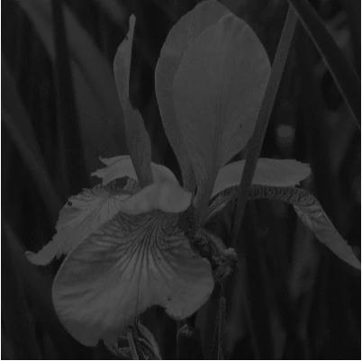
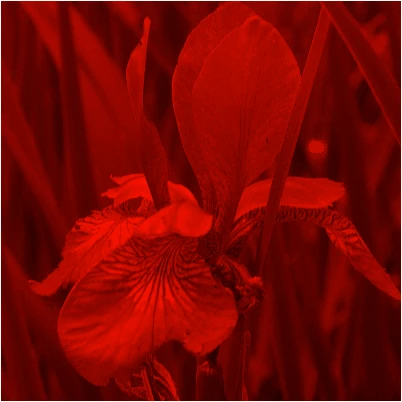
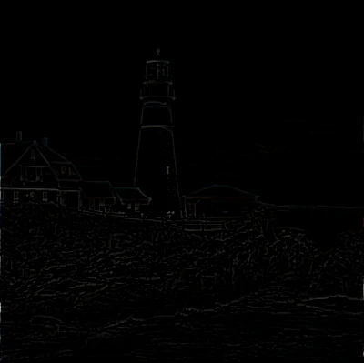
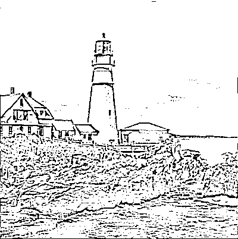
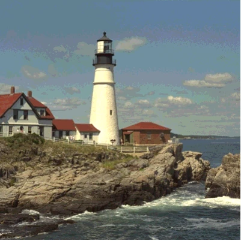
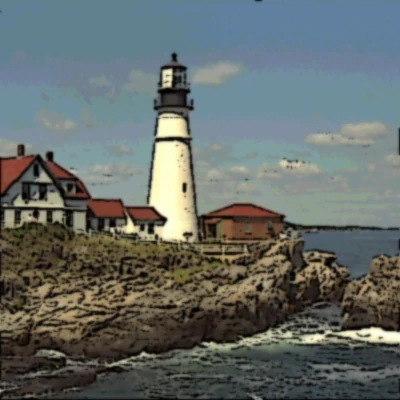

# Scrawl-canvas filters
The purpose of a computer graphics filter is to take an input graphic, apply a set of manipulations to each pixel in the graphic, and output the modified result. For web pages, filter algorithms are generally applied to elements – including `<canvas>` elements – using the [CSS filter property](https://developer.mozilla.org/en-US/docs/Web/CSS/filter).

> **tl;dr:** Filter effects – however they are used in a web page – are often computationally expensive and risk slowing down page speed and responsiveness. Use filters wisely!

## CSS and SVG filters
CSS filters are a set of functions which the product-dev can use to quickly apply a range of effects – `blur()`, `saturate()`, `drop-shadow()`, etc – either to a DOM element or to the background behind that element. While these filters can be stacked (eg: sepia + blur), for more advanced effects CSS offers a `url()` filter, which allows the product-dev to apply an [SVG-defined filter effect](https://developer.mozilla.org/en-US/docs/Web/SVG/Reference/Element/filter) to the element.

Note that SVG filters are complex and powerful. In addition to the MDN page linked above, the following resources may be of interest to the inquisitive:
+ (Webplatform, 2015) – [A summary of the various SVG filter primitives](https://webplatform.github.io/docs/svg/tutorials/smarter_svg_filters/)
+ (Codrops, 2019) – [A series of articles around SVG filters](https://tympanus.net/codrops/2019/01/15/svg-filters-101/)
+ (yoksel.github.io) – [An interactive SVG filters playground](https://yoksel.github.io/svg-filters/#/)

Browsers extend the use of these filters to JavaScript-driven paint operations in the `<canvas>` element. The canvas context engine includes a [filter property](https://developer.mozilla.org/en-US/docs/Web/API/CanvasRenderingContext2D/filter) (note: the key is singular), which product-devs can use to apply CSS filters to specific fill and stroke invocations. SC implements this functionality via regular `set` function calls: `cell.set({filter: string})` for the entire Cell object's display, and `entity.set({filter: string})` for individual entity objects within the display. Test demo [Filters-501](../../demo/filters-501.html) shows this functionality in action.

## The SC filter factory
While browsers have (for the most part) supported general CSS filter functionality since 2013, extending that support to the canvas context engine `engine.filter` property has lagged and (as of November 2025, with respect to Safari browsers) remains incomplete.

Given how useful filter functionality can be for creating various `<canvas>`-based displays and products, repo-devs built a bespoke filter engine into SC. Much of the functionality for the filter engine is defined in the [helper/filter-engine.js](../source/helper/filter-engine.html) file. This filter engine – which is an entirely novel filter system, separate from CSS filters – acts as a singleton object, created during SC initialization, and handles all SC-specific filter effect processing across all `<canvas>` elements present on the web page.

> **tl;dr:** The SC filter engine has been inspired by (the better parts of) the [Filter Effects Module Level 1](https://drafts.fxtf.org/filter-effects/) specification (which itself is based on the [SVG 1.1 (Second Edition) Filter Effects](https://www.w3.org/TR/SVG11/filters.html) specification). *It is* ***NOT an emulation*** *of that specification*.

### The `scrawl.makeFilter()` factory function
SC filters have been built to operate seamlessly with the wider SC environment. Product-devs can create a Filter object using the `scrawl.makeFilter()` factory function. Once created, the filter can be applied multiple times to Cell, Group and entity objects by adding it to their `filters` (note: the key is plural!) Array:
+ Filter objects can be applied to entity, Group and Cell objects during their instantiation using the `filters: ['name-string', Filter-object, ...]` attribute. This attribute expects to receive an Array of Filter objects and/or those objects' `name` strings.
+ Following instantiation, any entity, Group or Cell object can have its `filters` Array updated using the `object.addFilters('name-string', Filter-object, ...)`, `object.removeFilters('name-string', Filter-object, ...)` and `object.clearFilters()` functions.

The code associated with assigning and managing Filter objects on Cell, Group and entity objects can be found in the [mixin/filter.js](../source/mixin/filter.html) file. The factory function code itself is defined in the [factory/filter.js](../source/factory/filter.html) file.

#### Create Filter objects
Dev users can instantiate a Filter object at any time using the `scrawl.makeFilter({key: value, ...})` factory function. The factory takes a single object for its argument, all of whose attributes are optional:
```
Attribute   Type             Default               Comments
----------  ---------------  --------------------  ---------------------------------------------------
name        String           computer-generated    Must be unique
actions     ActionObject[]   []                    Action objects define filter actions
method      String           ''                    Convenience alternative to generate ActionObjects
lineIn      String           ''                    ID string of chained filter input
lineMix     String           ''                    ID string of chained filter input
lineOut     String           ''                    ID string for this filter's output
opacity     Number           1                     Float number between 0 and 1
...                                                (Additional ActionObject-specific attributes)
```

The Filter objects generated by the `scrawl.makeFilter()` factory function are *tracked objects*, thus each object requires its own unique `name` attribute when being instantiated. Once created, they can be retrieved from the SC library using the `scrawl.findFilter('name-string')` function.

There are actually two ways to use the factory function, both of which are equally valid:
+ For the *modern* approach, product-devs can define an Array of **action objects** keyed to the `actions` attribute. These action objects outline a set of **filter primitive functions**, alongside the values to be fed into those functions, which together create the desired filter effect.
+ The *legacy* approach uses the `method` attribute, alongside the required attributes for the method. SC will automatically create the appropriate action objects for the stipulated method as part of the Filter object's instantiation.

While the modern approach offers more versatility when it comes to chaining filter primitive functions together to create complex effects, the legacy approach is often more convenient for creating simpler effects. It is also easier to animate legacy filter attributes. Compare the different approaches to creating a simple pixellation filter:
```
Legacy approach                           Modern approach
--------------------------------------    -----------------------------------
const pixels = scrawl.makeFilter({        const pixels = scrawl.makeFilter({
  name: 'my-pixellated-filter',             name: 'my-pixellated-filter',
  method: 'pixelate',                       actions: [{
  tileWidth: 20,                              action: 'pixelate',
  tileHeight: 20,                             offsetX: 8,
  offsetX: 8,                                 offsetY: 8,
  offsetY: 8,                                 tileHeight: 20,
});                                           tileWidth: 20,
                                            }],
                                          });
```

More complex filters – such as this comic-effect filter, as seen in test demo [Filters-103](../../demo/filters-103.html) – are easier to build and edit using the modern approach:
```
const comicFilter = scrawl.makeFilter({
  name: 'my-comic-effect-filter',
  actions: [{
    action: 'gaussian-blur',
    radius: 1,
    lineOut: 'outline1',
  }, {
    action: 'matrix',
    lineIn: 'outline1',
    lineOut: 'outline2',
    width: 3,
    height: 3,
    offsetX: 1,
    offsetY: 1,
    weights: [0,1,0,1,-4,1,0,1,0],
  }, {
    action: 'threshold',
    lineIn: 'outline2',
    lineOut: 'outline3',
    level: 6,
    high: [0, 0, 0, 255],
    low: [0, 0, 0, 0],
    includeAlpha: true,
  }, {
    action: 'gaussian-blur',
    radius: 1,
    lineIn: 'outline3',
    lineOut: 'outline4',
  }, {
    action: 'step-channels',
    clamp: 'round',
    lineOut: 'color1',
    red: 16,
    green: 16,
    blue: 16,
  }, {
    action: 'gaussian-blur',
    radius: 4,
    lineIn: 'color1',
    lineOut: 'color2',
  }, {
    action: 'compose',
    compose: 'destination-over',
    lineIn: 'color2',
    lineMix: 'outline4',
  }],
});
```

#### Serialize, clone and kill Filter objects
Filter objects can be serialized using the `filter.saveAsPacket()` function. To deserialize a Filter packet string use either `object.importPacket('url-string' | ['url-string', ...])` or `object.actionPacket('packet-string')` functions where `object` is any existing SC *tracked object*.

To clone a Filter object, use the `filter.clone({key: value, ...})` function. Data included in the function's argument object will overwrite the existing Filter object's values.

The `filter.kill()` function will remove the Filter object entirely from the SC environment. This includes removing the filter from any Cell, Group or entity object that may be using it.

## Filter application
Filter objects are not part of the SC scene graph. Instead they are applied directly to the SC objects they have been associated with (via those objects' `filters` attribute array), as follows:
+ For Cell objects, their associated Filter objects are applied at the point where the Cell stamps itself onto its host Cell, at the end of the `compile` operation of the Display cycle.
+ Group objects set up their filtered output by instructing their associated entity Objects to stamp themselves onto a `pool` Cell that the Group instantiates and supplies; the filters are then applied to the pool Cell before it is stamped into the Group object's host Cell (near the end of the `compile` operation of the Display cycle).
+ Entity objects also make use of `pool` Cells to generate their filtered output, which then gets stamped onto whichever Cell object their Group object has supplied to them (that is: the host Cell for unfiltered Groups, or another `pool` Cell for filtered Groups).

Note that both CSS/SVG filters, and SC Filter objects, can (in theory) be applied to a Cell or entity object at the same time. The advice to product-devs considering such an approach is: don't! Filters are expensive operations; invoking two entirely separate filter systems on the same object will increase the risk of page performance degredation.

### Stacking filters
CSS filters can be combined:
```
<div class="filtered-div">
  <p>This is a div element with a CSS filter effect applied to it</p>
</div>

<style>
  .filtered-div {
    filter: hue-rotate(90deg) drop-shadow(6px 6px 2px black);
  }
</style>
```

In the above example, the browser will first apply the `hue-rotate` filter to the `<div>` element, then pass the result of that pixel manipulation to the `drop-shadow` filter for further processing before delivering the final output to the browser's display.

The simplest way to think of this is as a form of layer stacking: the original input goes at the bottom of the stack then each filter is added, in turn, over the original input until all the filters have been applied. In effect, the output from the previous filter becomes the input for the next filter. The end-user only sees the top of the stack; that is, the final result of the entire operation.

The SC filter engine follows much the same process (unless directed otherwise). When an entity with an Array of Filter objects gets stamped on its host Cell, the filter engine will take all of those filters and apply their primitive functions, in turn, to the entity display. Only after the last primitive function completes does the filter engine return the results to the SC system for stamping onto the host Cell.

This means that the order in which Filter objects appear in the `entity.filters` Array becomes very important:

```
scrawl.makeFilter({
  name: 'my-gray-filter',
  method: 'gray',
}).clone({
  name: 'my-red-filter',
  method: 'red',
});

// This first image will have all of its blue/green channel colors set to 0
// before the cross-channel-averaging gray effect is applied 
// - it will display as (a dark) monochrome white
scrawl.makePicture({
  name: 'gray-image',
  asset: 'iris',
  dimensions: ['100%', '100%'],
  copyDimensions: ['100%', '100%'],
  filters: ['my-red-filter', 'my-gray-filter'],

// This cloned image has the filters defined in reverse order
// - it will display as monochrome red
}).clone({
  name: 'red-image',
  filters: ['my-gray-filter', 'my-red-filter'],
});
```

| input > red > gray > output | input > gray > red > output |
|---|---|
|||

### Chaining filters
SVG filters include a way to define the inputs for an SVG filter primitive, and label the primitive's output so that it can be used as an input for a subsequent primitive operation. This method of **filter chaining** is what gives SVG filters their unique power to break away from the linear stacking approach to filter composition.

SC follows in SVG's footsteps. Every SC filter primitive function includes `lineIn` and `lineOut` argument attributes to define the primitive's input data and output label; some functions also require a `lineMix` attribute 

#### Input and output identifiers
When an SC object invokes the filter engine to create a filtered output, it will include an [imageData object](https://developer.mozilla.org/en-US/docs/Web/API/ImageData) of its unfiltered display for the filter engine to work on. The imageData dimensions will match the dimensions of the host Cell on which the filtered output will eventually be stamped.

When the SC filter engine receives this imageData, it's first action will be to ***unwrap*** the data in preparation for work. Three copies of the imageData object will be cached:
+ `source` – this copy is never altered by the filters.
+ `sourceAlpha` – this copy is mutated: all pixel color channels get set to `0`, while the pixel's alpha channel is set to `0` for transparent pixels, `255` otherwise.
+ `work` – this is the working copy of the imageData object.

The filter engine then iterates through each filter action object. When the object's action function is invoked, it will check the object's `lineIn` (and `lineMix`, if required) attribute and select its input data as follows:
+ `lineIn: 'source'` – use the `cache.source` imageData.
+ `lineIn: 'source-alpha'` – use the `cache.sourceAlpha` imageData.
+ `lineIn: undefined` – use the `cache.work` imageData.

The `lineIn` and `lineMix` attributes can also be String identifiers:
+ Whenever an action function completes, it will replace the `cache.work` imageData object with its own modified imageData output – except where the action object's `lineOut` identifier String has been defined, in which case the output will be stored in a new `cache[identifier]` attribute.
+ Once a new `cache[identifier]` attribute has been created, any subsequent action function can use that identifier String for their `lineIn` (and `lineMix`) attribute value. The function will use that identifier's imageData object for its input.

The following example shows the steps involved in creating the filtered output for the comic filter effect, whose code was shown earlier on this page:

| Filter | Input | Output |
|---|---|---|
|**Path 1 step 1** <br> `action: 'gaussian-blur'` <br> `lineIn: undefined` <br> `radius: 1` <br> `lineOut: 'outline1'`|||
|**Path 1 step 2** <br> `action: 'matrix'` <br> `lineIn: 'outline1'` <br> `width: 3'` <br> `height: 3'` <br> `offsetX: 1'` <br> `offsetY: 1` <br> `weights: [0,1,0,1,-4,1,0,1,0]` <br> `lineOut: 'outline2'`|||
|**Path 1 step 3** <br> `action: 'threshold'` <br> `lineIn: 'outline2'` <br> `level: 6` <br> `high: [0,0,0,255]` <br> `low: [0,0,0,0]` <br> `includeAlpha: true` <br> `lineOut: 'outline3'`|||
|**Path 1 step 4** <br> `action: 'gaussian-blur'` <br> `lineIn: 'outline3'` <br> `radius: 1` <br> `lineOut: 'outline4'`|||
|**Path 2 step 1** <br> `action: 'step-channels'` <br> `lineIn: undefined` <br> `red: 16` <br> `green: 16` <br> `blue: 16` <br> `clamp: 'round'` <br> `lineOut: 'color1'`|||
|**Path 2 step 2** <br> `action: 'gaussian-blur'` <br> `lineIn: 'color1'` <br> `radius: 4` <br> `lineOut: 'color2'`|||

| Filter | Input 1 | Input 2 | Output |
|---|---|---|---|
|**Composition step** <br> `action: 'compose'` <br> `lineIn: 'color2'` <br> `lineMix: 'outline4'` <br> `compose: 'destination-over'` <br> `lineOut: undefined`||||

### Filter opacity
All SC filter primitive functions include a final step – a crude channel-by-channel blending of the function's input imageData data and its calculated output data. The strength of this blend is set in the filter's `opacity` attribute:
+ For `opacity: 0`, the final output is 100% input + 0% calculated effect
+ For `opacity: 1`, the final output is 0% input + 100% calculated effect
+ For `opacity: 0.4`, the final output is 60% input + 40% calculated effect
+ ... etc.

Most of the Filter test demos include an `opacity` control for repo-dev testing and product-dev investigation.

### Using objects as filter stencils
CSS/SVG filters can be used to add a filter effect to the background behind a DOM element, via the [CSS backdrop-filter property](https://developer.mozilla.org/en-US/docs/Web/CSS/backdrop-filter).

In a similar vein, SC filters can be applied to the (currently stamped) display behind an SC entity object, or a Group of such objects. Product-devs can set up this effect by setting the object's `isStencil` attribute to `true`.

Note that the object will not be able to memoize its filtered output – there's no way that SC can predict whether the background behind an entity has changed between Display cycle frames.

Test demo [Filters-028](../../demo/filters-028.html) demonstrates stencilled filter effects.

### Memoizing a filtered object's output
For any SC-controlled `<canvas>` which includes any animated effects in its display, that canvas needs to update at a minimum of 20 frames-per-second (fps) – every 50 milliseconds – to make the animation tolerable for the end-user, and preferably should update at a rate of 60fps (16ms) for a smooth animation effect. Some device/screen combinations allow for an update rate of 120fps (8ms) or higher!

This means that SC must complete all of a Display cycle's required updates – across all `<canvas>` elements currently animating on the web page – within 16ms. For scenes which include filtered Cell, Group or entity objects this can be a difficult ask, given the intense computational nature of filter calculations.

Thus it makes sense for filtered objects to cache – ***memoize*** – their filtered output as comprehensively as possible. Product-devs can achieve this by setting the `memoizeFilterOutput` attribute to `true` on these objects.

SC attempts to make the memoization process as painless as possible for product-devs. Much of the functionality has been internalized so setting the `memoizeFilterOutput` flag should be the only action the product-dev has to take.

#### Internal memoization functionality
When a filtered object first has its `memoizeFilterOutput` flag set to `true` it will generate a random String and associate it to its internal `filterIdentifier` attribute. The first time the filter engine processes the object's filters and generates an output it will lodge that output in the SC workstore, keyed to the identifier string, before returning the output for stamping.

The next time the filter engine encounters the object, it will check the workstore for the identifier key. If the key exists, the engine immediately returns that previously generated output.

There are a number of actions that can invalidate the memoized filter output. These include:
+ Any change to the filtered object's position, dimensions, scale, rotation or other styling.
+ Any change to the Array of filters that need to be applied to the object, or (for legacy filters) changes to an associated Filter object's attributes.
+ Objects acting as a filter stencil cannot be memoized as there's no way to predict that the canvas display behind the object has not changed
+ Filtered Cell object output cannot be memoized (for the same reason).

Whenever the product-dev triggers such changes, the object will set a `dirtyFilterIdentifier` flag which in turn will cause the object to set its `filterIdentifier` attribute to a new random String. The next time the filter engine encounters the object it will not find the new identifier in the SC workstore, leading to it running all the required filter operations on the object and lodging that output in the workstore keyed to the new identifier.

The workstore regularly purges unaccessed keys – the output keyed to the old identifier will generally be purged one second after it was last accessed.

### One-time capture of a filtered object's output
SC includes three functions to capture either a Cell, Group or entity object's output in a DOM `` element which can then be imported into the SC environment as an ImageAsset object. These functions (defined in the [asset-management/image-asset.js](../source/asset-management/image-asset.html) file) are:
+ `scrawl.createImageFromCell(object, assetName)`
+ `scrawl.createImageFromGroup(object, assetName)`
+ `scrawl.createImageFromEntity(object, assetName)`

Where:
+ The `object` argument is either the Cell, Group or entity object, or that object's `name` attribute value.
+ The `assetName` argument is the String `name` value which will be given to the new Asset object.

These functions are one-shot functions: the capture will happen as part of the next Display cycle. The functionality includes adding the visual output to an `` element in the DOM, as a child of an appropriately hidden `<div>` element within the `<canvas>` element. The action is necessarily asynchronous, thus the new Asset object may take a few additional iterations of the Display cycle to show up.

There are various reasons why a product-dev may want to capture a static image of a Cell, Group or entity object – for instance when a particularly complicated filter has been applied to that object's display but it is not possible to memoize the object's output.

Once the new asset is captured it can be displayed multiple times in canvas scenes using Picture entitys. For example, see test demos [Canvas-046](../../demo/canvas-046.html), and [Canvas-020](../../demo/canvas-020.html).

The code associated with this functionality is closely tied with the filter functionality code (described below) as both functionalities rely on using `pool` Cell objects for generating their output.

### Internal coding protocols
The work to set up a Cell, Group or entity object to be modified by SC filters, and to display the filtered results on a host Cell, happens outside of the SC filter engine and factory code. 

Due to Cell, Group and entity objects having distinct roles in the Display cycle, the protocols for applying filters to them necessarily differ – as described below. All of this functionality happens internally; the product-dev only needs to add filters to the objects for the processes to take place.

#### Apply filters to Cell objects
SC Cell object filters are applied at the end of the Cell's participation in the Display cycle `compile` operation, after all entitys have stamped themselves onto its display. This filtered result will directly replace the original image data, ready for final display as part of the Display cycle `show` operation.

Any required output stashing functionality (as requested by `scrawl.createImageFromCell()`) happens after the filtering functionality completes.

This functionality is all defined in the [factory/cell.js](../source/factory/cell.html) file, specifically the `cell.compile()`, `cell.applyFilters()` and `cell.stashOutputAction()` functions.

#### Apply filters to Group objects
At the start of every Display cycle `compile` operation, each Cell object goes through its Array of associated Group objects and invokes the `group.stamp()` function on each of them in turn. This leads to the Group object performing the following protocol:
1. Determine whether any filters have been associated with the Group object, or if output needs to be stashed (as requested by `scrawl.createImageFromGroup()` function):
  – If yes, retrieve a `pool` Cell object and set its dimensions to the Group's host Cell object's dimensions.
  – If no, use the Group's host Cell object for the following steps.
2. Prepare the Group object's associated entity objects for stamping by invoking `group.prepareStamp()`.
3. Invoke the `group.stampAction()` function, passing it the `pool` Cell object if one has been created.
4. All associated entity objects now stamp themselves onto the required Cell object (as determined in step 1).
5. If a `pool` Cell was supplied as the function's argument and Filter objects have been associated with the group, invoke the `group.applyFilters()` function:
  – If the group is acting as a stencil, do the work to retrieve the host Cell's current display and stamp it onto the `pool` Cell, clipped by the Group's entity object's stamped displays.
  – Preprocess the filters to load any external assets into the filter engine.
  – Invoke the filter engine, passing it the necessary input and filter data.
  – Stamp the filter engine's results onto the host Cell.
6. If output stashing is required then invoke the `group.stashAction()` function.
7. If a `pool` Cell object was used, release it back to the pool.

This functionality is all defined in the [factory/group.js](../source/factory/group.html) file.

#### Apply filters to entity objects
SC filters are applied to the display output of entity objects at the point where they are stamped onto their host Cell. This is achieved using the following protocol:
1. Determine whether any filters need to be applied to the entity:
  – If no, use the entity's `regularStamp` functionality (not detailed below).
  – If yes, use the entity's `filteredStamp` functionality.
2. If the entity has not been stamped before, or its `entity.dirtyFilters` flag is `true`, process the filter objects into the internal `entity.currentFilters` Array so they are ready for application.
3. Request a `pool` Cell object, size it to match the host Cell's dimensions and `regularStamp` the entity onto it (ignoring the `entity.globalCompositeOperation` attribute).
  – If the `entity.isStencil` Boolean flag has been set to `true`, stamp the host Cell's current display over the entity (using `globalCompositeOperation: 'source-in'`).
4. Get the current image data from the `pool` Cell.
5. Preprocess the filter objects – specifically to retrieve data for any external images used by the filters.
6. Invoke the filter engine's `filterEngine.action()` function, passing all the required data to it.
7. Reset the `pool` Cell and stamp the filter engine's returned `imageData` data into it.
8. If the `entity.stashOutput` Boolean flag has been set to `true`, stash the `pool` data, either in a DOM `` element or as `imageData` assigned to the `entity.stashedImageData` attribute.
9. Stamp the `pool` Cell onto the host Cell (taking into account the `entity.globalCompositeOperation` attribute).
10. Release the `pool` Cell object.

All entity objects, apart from the EnhancedLabel entity, share the above functionality, whose code can be found in the [mixin/entity.js](../source/mixin/entity.html) file – specifically the `filteredStamp()` and `getCellCoverage()` functions.

#### Apply filters to EnhancedLabel entity objects
Because the EnhancedLabel entity is so tightly coupled with the [SC text layout engine](sc-text-layout-engine.html), repo-devs have had to replicate the entity filter protocol in that entity's factory function. Thus changes in the entity filter protocol will need to be replicated in the [factory/enhanced-label.js](../source/factory/enhanced-label.html) file.

## The SC filter engine
The filter engine has been designed as a single, standalone JS object that handles all SC filter requirements across all SC-controlled `<canvas>` elements on a web page. The object instantiates when the SC library first runs, which generally happens when it is first imported into the page during page load.

All engine functionality can be found in the [helper/filter-engine.js](../source/helper/filter-engine.html) file. The file exports the instantiated object itself to other files in the SC environment. Files that import the object should only use the `engine.action(packetObject)` function which takes a packet of data as its argument and returns an [ImageData object](https://developer.mozilla.org/en-US/docs/Web/API/ImageData) ready to be painted onto a [CanvasRenderingContext2D](https://developer.mozilla.org/en-US/docs/Web/API/CanvasRenderingContext2D) engine.

### Code efficiency
The SC filter engine has been built around the principle of manipulating [ImageData object](https://developer.mozilla.org/en-US/docs/Web/API/ImageData) pixel data, which presents as a [Uint8ClampedArray](https://developer.mozilla.org/en-US/docs/Web/JavaScript/Reference/Global_Objects/Uint8ClampedArray) whose elements are restricted to being positive integer Numbers in the range `0`-`255`.

Each pixel in the image data is coded in the [sRGB color space](https://developer.mozilla.org/en-US/docs/Glossary/RGB) using three color channels and an additional alpha channel, always in the order `[red, green, blue, alpha]`. This means that for an ImageData object with a width of 100px and a height of 50px, the `imageData.data` Array will be `100 * 50 * 4 = 20,000` elements long.

Given the (potentially huge) sizes that these image data Arrays can reach, repo-devs need to be particularly strict when it comes to coding up the data manipulations for filter primitive functions. The following guidelines may help:
+ Precalculate any requirements that a primitive function may have – for instance, the locations of pixels in a matrix calculation, or the pixels that make up a tile – and cache the results in case other primitive functions can make use of them.
+ Where it makes sense, use appropriate JS typed arrays to process data, alongside binary operators and masks, to reduce the number of array accesses performed by the filter.
+ Always try to process the data array in a single pass. For instance, rather than use two loops to process image data by rows and columns, repo devs should use a single loop and calculate row/column positions within that loop.
+ Always check to see if the current pixel is transparent (its alpha channel has a value of `0`) and, if yes, skip the calculations for that pixel if possible.
+ When dealing with non-RGB color space calculations, use the color caches – calculating a pixel's OKLCH channel values is very computationally expensive which is why the results of the first calculation for a given color should be cached.

#### Filter regions
A key difference between SVG filters and SC filters is that the SVG restricts its filter computations to a [filter effects region](https://www.w3.org/TR/SVG11/filters.html#FilterEffectsRegion). It takes this approach to limit the pixel area that needs to be processed by its filter functions.

SC does not take this approach. Instead the ImageData object that the filter engine receives will have the dimensions of the host Cell where the filter results will be applied. When a product-dev applies a filter to a `10px x 10px` Block entity, and a Wheel entity with radius `10px`, both appearing on a `100px x 100px` Cell, the ImageData objects presented to the filter engine will include a data Array containing (`100 x 100 x 4 = 40,000`) elements.

Consider the situation where both the Block and Wheel entitys have the same `pixellate` filter applied to them. The pixellate primitive function, as part of its work, will generate a set of objects containing the location details (the data Array indexes) for the pixels contained in each of the tiles required to generate the effect. It calculates this locations data across the entire ImageData, and stashes the results in the SC workstore. Thus while the calculation may happen for the first entity the primitive function encounters, for every other entity on that Cell using the same filter the primitive function only needs to retrieve those calculated results from the workstore – and this remains true even if the Block or Wheel entitys subsequently change their dimensions, scale or position.

> **tl;dr:** SVG filter regions are (often) tied to the elements to which the filter is applied. SC filter regions are tied to the Cell on which their effects appear.

While it may seem sensible to limit the area over which a filter effect gets applied, to minimize the calculation effort, the current SC approach – paradoxically – doesn't seem to significantly damage filter performance. This can be seen in test demo [Canvas-007](../../demo/canvas-007.html).

#### External caching using the SC workstore
The SC `workstore` is a keyed object used for longer-term caching of generated data. Like the SC library and the filter engine itself, only one `workstore` object exists in the SC environment, instantiated at the same time as those other objects during page initialization.

The `workstore` itself (alongside an accompanying `workstoreLastAccessed` object which helps keep track of stale workstore items) is not exported. Instead the [helper/workstore.js](../source/helper/workstore.html) file exports getter and setter functions that other SC files can import:
+ `checkForWorkstoreItem('key')`
+ `getWorkstoreItem('key')`
+ `setWorkstoreItem('key', data)`
+ `getOrAddWorkstoreItem('key', data)`
+ `setAndReturnWorkstoreItem('key', data)`

The filter engine makes extensive use of the workstore. Many of the calculations undertaken by the engine are expensive, thus it makes sense to cache the results after their first calculation to speed up future operations.

If a Cell, Group or entity object has requested that its filtered output be memoized, then the final results of those filter operations will also be cached in the workstore, keyed to the object's `filterIdentifier` attribute.

#### Filter engine internal cache
The filter engine includes a `cache` object which gets reset to an empty object every time the `engine.action()` function gets invoked. This cache holds references to the initial ImageData objects supplied to the `action()` function, alongside any intermediate ImageData objects created as the engine processes the filter action objects.

### Additional resources used by the filter engine
Color space conversion calculations are expensive. For this reason SC will cache the results of each calculation in an object containing a set of three Arrays. This object gets stored in the SC workstore keyed to the `color-point-arrays` String. This work is handled by the [SC color engine](sc-styles.html) on behalf of the filter engine.

The filter engine file also imports a number of pool functions, which repo-devs can then use when building and maintaining the filter primitive functions. As ever, always release a pooled object after using it – failure to release can lead to slow memory leaks:
+ `releaseCell`, `requestCell`
+ `releaseCoordinate`, `requestCoordinate`
+ `releaseArray`, `requestArray`

#### The seeded random numbers generator
The filter engine's `getRandomNumbers()` function generates arrays of random numbers that get consumed by the `glitch`, `random-noise`, `reduce-palette` and `tiles` primitive functions. However these functions require their random numbers to be consistent.

For this reason, SC uses a [pseudorandom number generator](https://en.wikipedia.org/wiki/Pseudorandom_number_generator), whose code is defined in the [helper/random-seed.js](../source/helper/random-seed.html) file. This code, created by Gibson Research Corporation, has been taken verbatim from the [skratchdot/random-seed repository](https://github.com/skratchdot/random-seed) on GitHub. Repo-devs made the decision to directly import this code into the code base because: 1. it's very good at its job; and 2. SC prides itself on having no direct dependencies.

The generator repo itself includes a direct dependency on the [moll/json-stringify-safe repository](https://github.com/moll/json-stringify-safe). Again, SC takes that code and includes it in the [helper/random-seed.js](../source/helper/random-seed.html) file.

Licenses for the above code:
+ skratchdot/random-seed repository – [MIT](https://opensource.org/license/mit) – Gibson Research Corporation.
+ moll/json-stringify-safe – [ISC](https://opensource.org/license/isc-license-txt) – Isaac Z. Schlueter and Contributors.

#### Noise generators
Generating noise can be computationally intensive. In addition to random noise, SC makes use of [blue noise](https://en.wikipedia.org/wiki/Colors_of_noise#Blue_noise) and [ordered noise](https://en.wikipedia.org/wiki/Ordered_dithering), consumed by the `random-noise` and `reduce-palette` primitive functions.

The blue noise values Array has been retrieved from blue noise images donated to the [Public Domain](https://creativecommons.org/public-domain/) by Christoph Peters, who has a very interesting blog post on [how to generate blue noise](http://momentsingraphics.de/BlueNoise.html). SC keeps its blue noise values Array in the [helper/filter-engine-bluenoise-data.js](../source/helper/filter-engine-bluenoise-data.html) file, for convenience.

SC defines its own (much shorter) ordered noise values array in the filter engine code.

### Protocol for processing a filter request
While the filter engine has many functions defined on its prototype, only one is of interest for the wider code base: `engine.action(packet)`. This is the function that gets invoked whenever another part of the code base needs to apply filter manipulations to an ImageData object.

The `packet` argument supplied to the `action` function has the following shape:
```
{
  identifier: memoization identifier String 
  image: unprocessed ImageData object
  filters: An Array of filter action objects (detailed below)
}
```

The `action` function itself is simple:

```
engine.prototype.action = function (packet) {

  // Define helper variables 
  const { identifier, filters, image } = packet;
  const { actions, theBigActionsObject } = this;
  let i, iz, actData, a;

  // 1. Check to see if output data has been previously generated for this identifier
  const itemInWorkstore = getWorkstoreItem(identifier);
  if (itemInWorkstore) return itemInWorkstore;

  // 2. Populate the engine.actions Array with action objects
  actions.length = 0;

  for (i = 0, iz = filters.length; i < iz; i++) {

      actions.push(...filters[i].actions);
  }

  const actionsLen = actions.length;

  // 3. Only do work if there's work to be done
  // - The calling code should have already checked that there's a need to filter data
  if (actionsLen) {

    // 4. Populate engine's current cache object with initial DataObjects
    // - cache.source
    // - cache['source-alpha']
    // - cache.work
    this.unknit(image);

    // 5. Loop through each action object in turn
    for (i = 0; i < actionsLen; i++) {

      actData = actions[i];
      a = theBigActionsObject[actData.action];

      // 6. Only invoke the primitive function if it exists
      if (a) a.call(this, actData);
    }

    // 7. Cache the resulting ImageData object in the SC workstore, if required
    if (identifier) setWorkstoreItem(identifier, cache.work);

    // 8. Return the resulting ImageData object
    return cache.work;
  }

  // 9. If there was no work to do, return the unprocessed ImageData object
  return image;
}
```

## SC filter primitive functions
All primitive functions live in an object called `engine.theBigActionsObject`. They mostly follow a similar code design pattern:

```
// The requirements argument is an action object
[FUNCTION_NAME]: function (requirements) {

  // Define local functions at the top of the object

  // Get input, output (and mix, if required) ImageData objects
  const [input, output] = this.getInputAndOutputLines(requirements);

  // Setup convenience variables
  const iData = input.data,
      oData = output.data,
      len = iData.length;

  // Extract remaining data from the requirements object
  // - All variable values should have default values
  // - Except lineOut - which can be a String, or undefined (default)
  const {
    opacity = 1,
    includeRed = true,
    includeGreen = true,
    includeBlue = true,
    includeAlpha = true,
    lineOut,
  } = requirements;

  // Define additional variables that will be used in the processing loop
  let r, g, b, a, i;

  // The processing loop:
  // - Works on a per-pixel basis by stepping through the input Array
  // - Extracts the input data 
  // - Manipulates the data, as required
  // - Places the results of the data manipulation in the output Array

  // Note that many filters have been optimised to work with various bitwise masks and
  // operators. The code may look complex, but it is quick

  // Merge the input and output data in line with opacity requirements
  if (lineOut) this.processResults(output, input, 1 - opacity);
  else this.processResults(this.cache.work, output, opacity);
},
```

### Alpha channel filters
The following primitive functions primarily handle manipulations that affect a pixel's alpha channel, in particular for creating [chroma key compositing effects](https://en.wikipedia.org/wiki/Chroma_key).

Note that many other filters may impact with the pixel's alpha channel, though that is not their primary functionality.

#### Action: `area-alpha`
Places a tile schema across the input, quarters each tile and then sets the alpha channels of the pixels in selected quarters of each tile to the appropriate value specified in the `areaAlphaLevels` attribute. Can be used to create horizontal or vertical bars, or chequerboard effects:
+ Top left quadrant dimensions: `tileWidth`, `tileHeight`
+ Top right quadrant dimensions: `gutterWidth`, `tileHeight`
+ Bottom left quadrant dimensions: `tileWidth`, `gutterHeight`
+ Bottom right quadrant dimensions: `gutterWidth`, `gutterHeight`

The `offset` values represent an offset from the top-left corner of the display. Partial tiles will be displayed as appropriate along the top and left edges of the display.

Specify the new alpha channel values in the `areaAlphaLevels` attribute Array as follows:
+ [top-left quadrant, bottom-left quadrant, top-right quadrant, bottom-right quadrant]

Used by factory function method: `areaAlpha`.

See test demo [Filters-014](../../demo/filters-014.html).
```
Default object
{
  lineIn: '',
  lineOut: '',
  opacity: 1,

  areaAlphaLevels: [255, 0, 0, 0],
  gutterHeight: 1,
  gutterWidth: 1,
  offsetX: 0,
  offsetY: 0,
  tileHeight: 1,
  tileWidth: 1,
}
```

#### Action: `channels-to-alpha`
Calculates an average value from each pixel's included channels and applies that value to the pixel's alpha channel.

Used by factory function method: `channelsToAlpha`.

See test demo [Filters-037](../../demo/filters-037.html)
```
Default object
{
  lineIn: '',
  lineOut: '',
  opacity: 1,

  includeBlue: true,
  includeGreen: true,
  includeRed: true,
}
```

#### Action: `chroma`
Produces a [chroma key compositing effect](https://en.wikipedia.org/wiki/Chroma_key) across the input.

Using an array of `range` arrays, determines whether a pixel's values lie entirely within a range's values and, if true, sets that pixel's alpha channel value to zero. 
+ Since SC v8.16.0, the modification to the alpha channel value can be feathered to create a more subtle effect. Feather variables take positive integer numbers in the range `0` to `255`.

Each `range` array comprises six integer Numbers (between `0` and `255`) representing the following channel values: 
+ `[minimum-red, minimum-green, minimum-blue, maximum-red, maximum-green, maximum-blue]`

Used by factory function method: `chroma`.

See test demo [Filters-010](../../demo/filters-010.html).
```
Default object
{
  lineIn: '',
  lineOut: '',
  opacity: 1,

  ranges: [],

  featherRed: 0,
  featherGreen: 0,
  featherBlue: 0,
}
```

#### Action: `colors-to-alpha`
Produces a [chroma key compositing effect](https://en.wikipedia.org/wiki/Chroma_key) across the input.

Determine the alpha channel value for each pixel depending on the closeness to that pixel's color channel values to a reference color supplied in the `red`, `green` and `blue` arguments. These attributes' values should be integer Numbers (between `0` and `255`).

The sensitivity of the effect can be manipulated using the `transparentAt` and `opaqueAt` attribute values, both of which lie in the range `0-1`.

Used by factory function method: `chromakey`.

See test demo [Filters-011](../../demo/filters-011.html).
```
Default object
{
  lineIn: '',
  lineOut: '',
  opacity: 1,

  blue: 0,
  green: 255,
  red: 0,

  transparentAt: 0,
  opaqueAt: 1,
}
```

### Color channel filters
The following primitive functions primarily handle manipulations that affect a pixel's color channels.

#### Action: `alpha-to-channels`
Copies an input's alpha channel value over to each selected channel's value or, alternatively, sets that channel's value to zero, or leaves the channel's value unchanged. 

Setting the appropriate `includeChannel` flags will copy the alpha channel value to that channel; when that flag is false, setting the appropriate `excludeChannel` flag will set that channel's value to zero.

Used by factory function method: `alphaToChannels`.

See test demo [Filters-037](../../demo/filters-037.html)
```
Default object
{
  lineIn: '',
  lineOut: '',
  opacity: 1,

  excludeBlue: true,
  excludeGreen: true,
  excludeRed: true,
  includeBlue: true,
  includeGreen: true,
  includeRed: true,
}
```

#### Action: `average-channels`
Calculates an average value from each pixel's included channels and applies that value to all channels that have not been specifically excluded; excluded channels have their values set to `0`.

Used by factory function methods: `blue`, `cyan`, `emboss`, `gray`, `green`, `magenta`, `red`, `yellow`.

See test demos [Filters-001](../../demo/filters-001.html) and [Filters-002](../../demo/filters-002.html).
```
Default object
{
  lineIn: '',
  lineOut: '',
  opacity: 1,

  excludeBlue: false,
  excludeGreen: false,
  excludeRed: false,
  includeBlue: true,
  includeGreen: true,
  includeRed: true,
}
```

#### Action: `clamp-channels`
Clamp each color channel to a range determined by a set of `low` and `high` channel values. These attributes' values should be integer Numbers (between `0` and `255`). 

Used by factory function method: `clampChannels`.

See test demo [Filters-020](../../demo/filters-020.html).
```
Default object
{
  lineIn: '',
  lineOut: '',
  opacity: 1,

  highBlue: 255,
  highGreen: 255,
  highRed: 255,

  lowBlue: 0,
  lowGreen: 0,
  lowRed: 0,
}
```

#### Action: `flood`
Creates a uniform sheet of the required color, which can then be used by other filter actions. 

The color are set through the `red`, `green`, `blue` and `alpha` attributes; these attribute values should be integer Numbers (between `0` and `255`). 

The flood can be restricted to only apply to non-transparent input pixels using the `excludeAlpha` flag.

Used by factory function method: `flood`.

See test demos [Filters-013](../../demo/filters-013.html) and [Filters-037](../../demo/filters-037.html).
```
Default object
{
  lineIn: '',
  lineOut: '',
  opacity: 1,

  alpha: 255,
  blue: 0,
  green: 0,
  red: 0,

  excludeAlpha: false,
}
```

#### Action: `grayscale`
Averages the input's appropriately weighted color channel values for each pixel, to produce a more realistic black-and-white monochrome effect.

Used by factory function methods: `emboss`, `grayscale`.

See test demos [Filters-001](../../demo/filters-001.html) and [Filters-002](../../demo/filters-002.html).
```
Default object
{
  lineIn: '',
  lineOut: '',
  opacity: 1,
}
```

#### Action: `invert-channels`
Inverts the color channel values in the input (`0 > 255`, `200 > 55`, etc), producing an effect similar to a photograph negative. 

Color channels can be excluded from the calculation using the `include` flags.

Used by factory function method: `invert`.

See test demos [Filters-001](../../demo/filters-001.html) and [Filters-002](../../demo/filters-002.html).
```
Default object
{
  lineIn: '',
  lineOut: '',
  opacity: 1,

  includeBlue: true,
  includeGreen: true,
  includeRed: true,
  includeAlpha: false,
}
```

#### Action: `lock-channels-to-levels`
Produces a [posterization effect](https://en.wikipedia.org/wiki/Posterization) on the input. 

Takes in four arguments – `red`, `green`, `blue` and `alpha` – each of which is an Array of zero or more integer Numbers (between 0 and 255). 

The filter works by looking at each pixel's channel value and determines which of the corresponding Array's Number values it is closest to; it then sets the channel value to that Number value

Used by factory function method: `channelLevels`.

See test demo [Filters-006](../../demo/filters-006.html).
```
Default object
{
  lineIn: '',
  lineOut: '',
  opacity: 1,

  alpha: [255],
  blue: [0],
  green: [0],
  red: [0],
}
```

#### Action: `map-to-gradient`
Applies a gradient to a grayscaled input. 

The type of grayscale can be set using the `useNaturalGrayscale` flag. The grayscale is applied as part of the primitive function and does not need to be created in a prior chained ActionObject.

The `gradient` attribute can be a Gradient object, or that object's `name` attribute.

Used by factory function method: `mapToGradient`.

See test demo [Filters-022](../../demo/filters-022.html)
```
Default object
{
  lineIn: '',
  lineOut: '',
  opacity: 1,

  useNaturalGrayscale: false,
  gradient: default Gradient object,
}
```

#### Action: `modulate-channels`
Multiplies each channel's value by the supplied argument value. A channel-argument's value of `0` will set that channel's value to zero; a value of `1` will leave the channel value unchanged. 

If the `saturation` flag is set to `true` the calculation changes to start at that pixel's grayscale values.

Used by factory function methods: `brightness`, `channels`, `saturation`.

See test demos [Filters-003](../../demo/filters-003.html), [Filters-007](../../demo/filters-007.html).
```
Default object
{
  lineIn: '',
  lineOut: '',
  opacity: 1,

  alpha: 1,
  blue: 1,
  green: 1,
  red: 1,

  saturation: false,
}
```

#### Action: `set-channel-to-level`
Sets the value of each pixel's included channel to the value supplied in the `level` attribute.

Used by factory function methods: `notRed`, `notGreen`, `notBlue`.

See test demos [Filters-001](../../demo/filters-001.html) and [Filters-002](../../demo/filters-002.html).
```
Default object
{
  lineIn: '',
  lineOut: '',
  opacity: 1,

  includeAlpha: false,
  includeBlue: false,
  includeGreen: false,
  includeRed: false,

  level: 0,
}
```

#### Action: `step-channels`
Restricts the number of color values that each channel can set by imposing regular bands on each channel. This produces a [posterization effect](https://en.wikipedia.org/wiki/Posterization) on the input.

Takes three divisor values – `red`, `green`, `blue`. For each pixel, its color channel values are divided by the corresponding color divisor, floored to the integer value and then multiplied by the divisor. For example a divisor value of `50` applied to a channel value of `120` will give a result of `100`.

The `clamp` attribute determines where in the band the color reference value should fall:
+ `down` (default) – uses `Math.floor()` for the calculation.
+ `up` – uses `Math.ceil()`.
+ `round` – uses `Math.round()`.

Used by factory function method: `channelstep`.

See test demo [Filters-005](../../demo/filters-005.html).
```
Default object
{
  lineIn: '',
  lineOut: '',
  opacity: 1,

  blue: 1,
  green: 1,
  red: 1,

  clamp: 'down',
}

The clamp attribute permitted values are:
  'down',           'round',            'up'
```

#### Action: `threshold`
Creates a duotone effect across the input:
+ Grayscales the input.
+ For each pixel, checks the color channel values against a `level` argument: 
  – pixels with channel values above the level value are assigned to the `high` color;
  – otherwise they are updated to the `low` color.

The `high` and `low` attributes are both Arrays in the form:
+ `[redVal, greenVal, blueVal, alphaVal]` where values are positive integers in the range `0`-`255`.

If the `useMixedChannel` flag is set to `true`, processing occurs on a per-pixel level; otherwise processing happens on a per-channel basis. Individual channel levels can be set in the `red`, `green`, `blue` and `alpha` attributes. Channels can also be excluded from the calculation.

Used by factory function method: `threshold`.

See test demo [Filters-004](../../demo/filters-004.html).
```
Default object
{
  lineIn: '',
  lineOut: '',
  opacity: 1,

  level: 128,

  alpha: 128,
  blue: 128,
  green: 128,
  red: 128,

  low: [0, 0, 0, 0],
  high: [255, 255, 255, 255],

  includeRed: true,
  includeGreen: true,
  includeBlue: true,
  includeAlpha: false,

  useMixedChannel: true,
}
```

#### Action: `tint-channels`
Transforms an input's pixel values based on an interplay between the values of each pixel's channel values:
```
Red channel     = (val * redInRed)   + (val * greenInRed)   + (val * blueInRed)
Green channel   = (val * redInGreen) + (val * greenInGreen) + (val * blueInGreen)
Blue channel    = (val * redInBlue)  + (val * greenInBlue)  + (val * blueInBlue)

Where: 
  val = the pixel channel's original value
  multipliers are float Number values between 0 and 1
```

Used by factory function methods: `sepia`, `tint`.

See test demo [Filters-008](../../demo/filters-008.html).
```
Default object
{
  lineIn: '',
  lineOut: '',
  opacity: 1,

  blueInBlue: 1,
  blueInGreen: 0,
  blueInRed: 0,
  greenInBlue: 0,
  greenInGreen: 1,
  greenInRed: 0,
  redInBlue: 0,
  redInGreen: 0,
  redInRed: 1,
}
```

#### Action: `vary-channels-by-weights`
Applies an array of weights values to the input's pixel data. This represents a (vague) form of [tone mapping](https://en.wikipedia.org/wiki/Tone_mapping).

The `weights` Array needs to be exactly (256 * 4 = 1024) elements long. For each color level, we supply four weights: `redweight, greenweight, blueweight, allweight`
+ The default weighting for all elements is `0`. Weights are added to a pixel channel's value, thus weighting values need to be integer Numbers, either positive or negative
+ The `useMixedChannel` flag uses a different calculation, where a pixel's channel values are combined to give their grayscale value, then that weighting (stored as the `allweight` weighting value) is added to each channel value, pro-rata in line with the grayscale channel weightings. (Note: this produces a different result compared to tools supplied in various other graphic manipulation software).

Used by factory function method: `curveWeights`.

Product-devs are advised to find some way to generate the array data programmatically. See test demo [Filters-024](../../demo/filters-024.html) for inspiration.
```
Default object
{
  lineIn: '',
  lineOut: '',
  opacity: 1,

  weights: [],
  useMixedChannel: true,
}
```

### Composition filters
The following primitive functions use two inputs (for compositing). The external image import function is also grouped here. 

#### Action: `blend`
Uses two inputs – `lineIn`, `lineMix` – and combines their pixel data using various separable and non-separable blend modes, as defined in the [W3C Compositing and Blending recommendations](https://www.w3.org/TR/compositing-1/#blending) specification.

Note that the inputs may be of different sizes: the output – `lineOut` – image size will be the same as the source (NOT `lineIn`) image. The `lineMix` input can be moved relative to the `lineIn` input using the `offsetX` and `offsetY` attributes.

Used by factory function method: `blend`.

See test demo [Filters-102](../../demo/filters-102.html).
```
Default object
{
  lineIn: '',
  lineMix: '',
  lineOut: '',
  opacity: 1,

  blend: 'normal',
  offsetX: 0,
  offsetY: 0,
}

The blend attribute permitted values are:
  'chroma-match'    'color'           'color-burn'      'color-dodge'
  'darken'          'difference'      'exclusion'       'hard-light'
  'hue'             'hue-match'       'lighten'         'lighter'
  'luminosity'      'multiply'        'normal'          'overlay'
  'saturation'      'screen'          'soft-light'
```

#### Action: `compose`
Perform a Porter-Duff compositing operation on two inputs – see [W3C Compositing and Blending recommendations](https://www.w3.org/TR/compositing-1/#porterduffcompositingoperators) for details.

Note that the `lineMix` input – which MUST be specified – can be offset using the `offsetX` and `offsetY` attributes.

Used by factory function method: `compose`.

See test demo [Filters-101](../../demo/filters-101.html).
```
Default object
{
  lineIn: '',
  lineMix: '',
  lineOut: '',
  opacity: 1,

  compose: 'normal',
  offsetX: 0,
  offsetY: 0,
}

The compose attribute permitted values are:
  'destination-only'      'source-only'           'clear'
  'destination-over'      'source-over'           'xor'
  'destination-in'        'source-in'             'normal'
  'destination-out'       'source-out'
  'destination-atop'      'source-atop'
```

#### Action: `process-image`
Loads an image into the filter engine, where it can then be used by other filter actions. Useful for effects such as watermarking an image.

The portion of the image to be imported into the filter engine can be controlled using the `copy` attributes. These attributes can be set in either absolute pixel values, or relative (to the image) 'string%' values.

The `asset` attribute is required, and should be the name string of the asset. Any valid asset is permitted, including Cell objects. Where things go wrong, the system will attempt to load a `1x1` transparent pixel in place of the asset.

If the image's dimensions differ from the source dimensions then, where a given dimension is smaller than source, that dimension will be centered; where the image dimension is larger then that dimension will be pinned to the top, or left. Note that Filters will run faster when the asset's dimensions match the dimensions of the source to which the filter is being applied.

The `lineOut` attribute's value must be a (unique) string, which other primitive functions can use as their `lineIn` and `lineMix` values.

Used by factory function method: `image`.

See test demos [Filters-101](../../demo/filters-101.html) and [Filters-102](../../demo/filters-102.html), which include image filters.
```
Default object
{
  lineOut: '',

  asset: '',

  copyHeight: 1,
  copyWidth: 1,
  copyX: 0,
  copyY: 0,
}
```

### Convolution filters
The following primitive functions all make use of some form of [convolution matrix](https://en.wikipedia.org/wiki/Kernel_(image_processing)) for their image data manipulations.

#### Action: `blur`
A bespoke [box blur](https://en.wikipedia.org/wiki/Box_blur) function. Creates visual artefacts with various settings that might be useful. 

By default the visible chanels are included in the calculation while the `alpha` channel is excluded. Transparent pixels (which tend to be transparent black) can also be excluded from the calculation.

The functionality defines separate `radius` (box width and height) values for the vertical and horizontal passes. The number of `passes` performed can also be increased.

The `step` values are used to determine which pixels within the box should be included in the calculation; a greater `step` value will lead to more (potentially useful) visual artefacts in the result.

Used by factory function method: `blur`.

See test demo [Filters-033](../../demo/filters-033.html).
```
Default object
{
  lineIn: '',
  lineOut: '',
  opacity: 1,

  excludeTransparentPixels: false,
  includeAlpha: false,
  includeBlue: true,
  includeGreen: true,
  includeRed: true,

  passesHorizontal: 1,
  processHorizontal: true,
  radiusHorizontal: 1,
  stepHorizontal: 1,

  passesVertical: 1,
  processVertical: true,
  radiusVertical: 1,
  stepVertical: 1,
}
```

#### Action: `corrode`
Performs a special form of matrix operation on each input pixel's color and alpha channels, calculating the new value using neighbouring pixel values. This is (roughly) equivalent to the SVG [`<feMorphology>`](https://developer.mozilla.org/en-US/docs/Web/SVG/Reference/Element/feMorphology) filter primitive.

The matrix dimensions can be set using the `width` and `height` arguments, while setting the home pixel's position within the matrix can be set using the `offsetX` and `offsetY` arguments.

The operation will set the pixel's channel value to match either the lowest, highest, mean or median values as dictated by its neighbours – this value is set in the `operation` attribute.

Channels can be selected for inclusion in the calculation by setting the various `include` flags.

Used by factory function method: `corrode`.

See test demo [Filters-021](../../demo/filters-021.html).
```
Default object
{
  lineIn: '',
  lineOut: '',
  opacity: 1,

  includeAlpha: true,
  includeBlue: false,
  includeGreen: false,
  includeRed: false,

  height: 3,
  offsetX: 1,
  offsetY: 1,
  width: 3,

  operation: 'mean',
}

The operation attribute permitted values are:
  'lowest'    'highest'   'mean'
```

#### Action: `emboss`
Performs a [directional difference filter](https://en.wikipedia.org/wiki/Image_embossing) across the input, using a `3x3` weighted matrix.

The `angle` (measured in degrees) and `strength` attributes contribute to the weights used in the matrix.

The function also handles some post-processing effects, controlled by the `postProcessResults` and `keepOnlyChangedAreas` flags, and the `tolerance` positive float Number attribute.

Used as the final step by factory function method: `emboss`.

See test demo [Filters-018](../../demo/filters-018.html).
```
Default object
{
  lineIn: '',
  lineOut: '',
  opacity: 1,

  angle: 0,
  strength: 1,

  keepOnlyChangedAreas: false,
  postProcessResults: false,
  tolerance: 0,
}
```

#### Action: `gaussian-blur`
Generates a [gaussian blur](https://en.wikipedia.org/wiki/Gaussian_blur) effect from the input. 

The code behind this approach uses an [infinite impulse response](https://en.wikipedia.org/wiki/Infinite_impulse_response) algorithm to produce the blur. The concept was developed by IBM engineers but, sadly, the paper seems to have been removed from the IBM site. The IBM concept was adapted to run in Javascript by contributors to the [nodeca/glur](https://github.com/nodeca/glur/blob/master/index.js) GitHub repository – it is that code which repo-devs have adapted into the SC code base for this blur effect. The nodeca/glur code uses the [MIT](https://opensource.org/license/mit) license.

The horizontal and vertical parts of the blur can be separately set. Channels can also be excluded from the blur calculations, and the blur effect can be restricted to just the non-transparent parts of the input.

This filter can also be used to create a "single direction" motion blur effect, by setting the horizontal and vertical radius values to opposing large/small values and applying an angle value.

Note that this filter is prone to generating edge artefacts, such as a dark or gray border, or the blur displaying beyond the borders of the original image. These effects can be mitigated through an interplay of the `includeAlpha`, `excludeTransparentPixels` and `premultiply` flags.

Additionally, color channels can be excluded (to create halo effects) using the appropriate `include*` flags.

Used by factory function method: `gaussianBlur`.

See test demo [Filters-034](../../demo/filters-034.html).
```
Default object
{
  lineIn: '',
  lineOut: '',
  opacity: 1,

  radiusHorizontal: 1,
  radiusVertical: 1,
  angle: 0,

  premultiply: false,
  excludeTransparentPixels: false,
  includeAlpha: true,

  includeBlue: true,
  includeGreen: true,
  includeRed: true,
}
```

#### Action: `matrix`
Applies a [convolution matrix](https://en.wikipedia.org/wiki/Kernel_(image_processing)) (also known as a kernel, or mask) operation to the input.

The matrix dimensions must be set using the `width` and `height` attributes, and the weights for the matrix supplied in the `weights` attribute's Array. The length of the `weights` array must equal `width x height`.

The matrix does not need to be centered. Use the `offset` attributes to define the position of the home pixel within the matrix grid.

Individual channels can be excluded from the calculation.

When used for blurring effects, the filter can create edge artefacts (dark or gray borders, extension beyond the original image) - these can be controlled with an interplay between the `includeAlpha`, `premultiply` and `useInputAsMask` flags.

Used by factory function methods: `edgeDetect`, `matrix`, `matrix5`, `sharpen`.

See test demos [Filters-012](../../demo/filters-012.html), [Filters-038](../../demo/filters-038.html)
```
Default object
{
  lineIn: '',
  lineOut: '',
  opacity: 1,

  height: 3,
  offsetY: 1,
  offsetX: 1,
  width: 3,

  weights: [],

  includeBlue: true,
  includeGreen: true,
  includeRed: true,

  includeAlpha: false,
  premultiply: false,
  useInputAsMask: false,
}
```

#### Action: `newsprint`
Attempts to simulate a black-white dither effect similar to newsprint across the input.

The `width` attribute defines the size of the blocks used in the filter.

Used by factory function method: `newsprint`.

See test demo [Filters-016](../../demo/filters-016.html)
```
Default object
{
  lineIn: '',
  lineOut: '',
  opacity: 1,

  width: 1,
}
```

#### Action: `pixelate`
Averages the colors within a set of rectangular blocks across the input to produce a series of obscuring tiles.

Individual channels can be included in the calculation by setting their respective `include` flags.

The effect can be offset using the `offset` attributes (measured in `px`).

Used by factory function method: `pixelate`.

See test demo [Filters-009](../../demo/filters-009.html).
```
Default object
{
  lineIn: '',
  lineOut: '',
  opacity: 1,

  includeAlpha: false,
  includeBlue: true,
  includeGreen: true,
  includeRed: true,

  offsetX: 0,
  offsetY: 0,
  tileHeight: 1,
  tileWidth: 1,
}
```

#### Action: `tiles`
Covers the input with tiles whose color matches the average channel values for the pixels included in each tile. Has a similarity to the `pixelate` filter, but uses a set of coordinate points to generate the tiles which results in a more Delaunay-like output.

The filter has four modes, set on the `mode` attribute: `'rect'`, `'hex'`, `'random'`, `'points'`. Each mode has its own set of attributes:
+ **rect** - `rectWidth`, `rectHeight`, `originX`, `originY`, `angle`, `spiralStrength`
+ **hex** - `hexRadius`, `originX`, `originY`, `angle`, `spiralStrength`
+ **random** - `density`, `randomCount` (deprecated), `seed`
+ **points** - `pointsData`

Channels can be included in the calculation by setting the appropriate `include` flags.

Used by factory function method: `tiles`.

See test demo [Filters-015](../../demo/filters-015.html).
```
Default object
{
  lineIn: '',
  lineOut: '',
  opacity: 1,

  mode: 'rect',

  angle: 0,
  originX: 0,
  originY: 0,

  rectWidth: 10,
  rectHeight: 10,

  hexRadius: 5,

  spiralStrength: 0,

  density: '0%',
  randomCount: 20,          // Deprecated
  seed: DEFAULT_SEED,

  pointsData: [],

  includeAlpha: false,
  includeBlue: true,
  includeGreen: true,
  includeRed: true,
}
```

#### Action: `zoom-blur`
Applies a bespoke ease-weighted radial (“zoom”) blur with optional angle and jitter variation.

The filter samples along the line from each pixel to a chosen centre point, combining those samples with an ease-out weighting so the streaking increases with distance. An inner and outer radius define where the blur begins and ends, with an easing function controlling how smoothly it transitions across that span.

Parameters such as strength, samples, variation (per-pixel jitter driven by a seed), and angle (for an optional spin component) shape the overall character of the blur.

The include* channel flags, includeAlpha, excludeTransparentPixels, premultiply, and multiscale settings provide additional control over colour and alpha handling and help mitigate artefacts.

Product-devs should note that this filter is computationally heavy and should be used judiciously.

Used by factory function method: `zoomBlur`.

See test demo [Filters-040](../../demo/filters-040.html).
```
Default object
{
  lineIn: '',
  lineOut: '',
  opacity: 1,

  startX: '50%',
  startY: '50%',

  strength: 0.35,
  samples: 14,
  variation: 0,
  seed: DEFAULT_SEED,

  innerRadius: 0,
  outerRadius: 0,
  angle: 0,
  easing: 'linear',

  includeRed: true,
  includeGreen: true,
  includeBlue: true,

  includeAlpha: true,
  excludeTransparentPixels: true,
  multiscale: true,
  premultiply: false,
}
```

### Displacement filters
The following primitive functions handle the movement of pixel data around the image data Array

#### Action: `displace`
Moves pixels around the input image, based on the color channel values supplied by a displacement map image. This is the SC filter engine's attempt to reproduce the SVG [`<feDisplacementMap>`](https://developer.mozilla.org/en-US/docs/Web/SVG/Reference/Element/feDisplacementMap) filter primitive.

Note that the `lineMix` input – which MUST be specified – can be offset using the `offsetX` and `offsetY` attributes. Ideally, the mix image should be the same size as the input image, but it can be larger or smaller – hence the inclusion of these attributes. The displacement transform will only happen when both inputs have pixels at the appropriate coordinate

As for the SVG filter primitive, translations in the `x` and `y` axes are tied to the pixel values in a given color channel. These pixel values can be scaled.

When a pixel moves it can leave a copy of itself behind in case another pixel doesn't replace itself. If this behaviour is not wanted it can be switched off using the `transparentEdges` flag.

Used by factory function method: `displace`.

See test demo [Filters-017](../../demo/filters-017.html).
```
Default object
{
  lineIn: '',
  lineMix: '',
  lineOut: '',
  opacity: 1,

  channelX: 'red',
  channelY: 'green',
  offsetX: 0,
  offsetY: 0,
  scaleX: 1,
  scaleY: 1,

  transparentEdges: false,
  useInputAsMask: false,

The channelX and channelY attribute permitted values are:
  'red'       'green'     'blue'      'alpha'
```

#### Action: `glitch`
Generates a semi-random shift across the input's horizontal rows.

The effect can be generated across channels, or applied to channels separately, through the `useMixedChannel` flag. 

The `level` value (a float Number between `0` and `1`) determines the liklihood of a glitch occurring in a row, while the `step` value (a positive integer Number greater than 0) controls the number of rows to be included in each glitch.

The strength of the glitch is controlled by the various `offset` attributes.

Used by factory function method: `glitch`.

See test demo [Filters-025](../../demo/filters-025.html).
```
Default object
{
  lineIn: '',
  lineOut: '',
  opacity: 1,

  level: 0,
  seed: DEFAULT_SEED,
  step: 1,
  transparentEdges: false,

  useMixedChannel: true,
  offsetMax: 0,
  offsetMin: 0,

  offsetAlphaMax: 0,
  offsetAlphaMin: 0,
  offsetBlueMax: 0,
  offsetBlueMin: 0,
  offsetGreenMax: 0,
  offsetGreenMin: 0,
  offsetRedMax: 0,
  offsetRedMin: 0,

  transparentEdges: false,
  useInputAsMask: false,
}
```

#### Action: `offset`
Moves each channel input by an offset (measured in `px`) set for that channel.

Used by factory function methods: `offset`, `offsetChannels`.

See test demos [Filters-035](../../demo/filters-035.html), [Filters-036](../../demo/filters-036.html).
```
Default object
{
  lineIn: '',
  lineOut: '',
  opacity: 1,

  offsetAlphaX: 0,
  offsetAlphaY: 0,
  offsetBlueX: 0,
  offsetBlueY: 0,
  offsetGreenX: 0,
  offsetGreenY: 0,
  offsetRedX: 0,
  offsetRedY: 0,

  useInputAsMask: false,
}
```

#### Action: `random-noise`
Creates a stippling effect across the image.

The spread of the effect can be controlled using the `width` and `height` attributes (which can be negative). Product-devs can manage the intensity of the effect using the `level` attribute, which ranges from `0` to `1`.

The effect can be wrapped by setting the `noWrap` Boolean flag. Channels can be excluded from the calculations using their respective `include` flags.

The effect supports 3 noise types:
+ `random` noise creates a general spread effect; the [pseudorandom generator's](https://en.wikipedia.org/wiki/Pseudorandom_number_generator) `seed` can be set to any String value.
+ `ordered` and `bluenoise` noise can be used for more directional results.

Used by factory function method: `randomNoise`.

See test demo [Filters-023](../../demo/filters-023.html).
```
Default object
{
  lineIn: '',
  lineOut: '',
  opacity: 1,

  includeAlpha: true,
  includeBlue: true,
  includeGreen: true,
  includeRed: true,

  height: 1,
  level: 0,
  width: 1,

  excludeTransparentPixels: true,
  noiseType: 'random',
  noWrap: false,
  seed: DEFAULT_SEED,
}

The noiseType permitted values are:
  'bluenoise'     'ordered'       'random'
```

#### Action: `swirl`
For each input pixel, move the pixel radially according to its distance from a given coordinate and associated angle for that coordinate.

This filter can handle multiple swirls in a single pass. Each swirl is defined in an object with the following attributes:
+ The `start` and `radius` attributes can be defined in absolute `px` Number values, or relative `%` String values – relative to the input width.
+ The `angle` Number value is measured in degrees – a value of `720` will result in a swirl of 2 complete turns.
+ The `easing` value can be any valid easing string identifier (for example `'linear'`, `'easeOutIn'`, etc) or, alternatively, a product-dev defined easing function.

```
{
  startX: Number | String;
  startY: Number | String;
  innerRadius: Number | String;
  outerRadius: Number | String;
  angle: Number;
  easing: String | EasingFunctionObject;
}
```

Used by factory function method: `swirl`.

See test demo [Filters-026](../../demo/filters-026.html).
```
Default object
{
  lineIn: '',
  lineOut: '',
  opacity: 1,

  swirls: [],

  transparentEdges: false,
  useInputAsMask: false,
}
```

### OK color space filters
The following primitive functions manipulate pixel image data in the [CIELAB color space](https://developer.mozilla.org/en-US/docs/Glossary/Color_space#cielab_color_spaces) – in particular OKLAB and OKLCH.

Note also that the following <b>blend filter</b> effects - `color`, `hue`, `luminosity`, `saturation`, `hue-match` and `chroma-match` - perform their calculations in the OKLCH color space.

#### Action: `alpha-to-luminance`
For each pixel in the input, where alpha is not `0`:
+ Convert to OKLAB
+ Set L to alpha value
+ Set A and B to 0
+ Convert back to RGB

Used by factory function method: `alphaToLuminance`.

See test demo [Filters-037](../../demo/filters-037.html)
```
Default object
{
  lineIn: '',
  lineOut: '',
  opacity: 1,
}
```

#### Action: `luminance-to-alpha`
For each pixel in the input:
+ Calculate OKLAB luminance from RGB colors
+ Set alpha to luminance
+ Set color channels to `0`

Used by factory function method: `luminanceToAlpha`.

See test demo [Filters-037](../../demo/filters-037.html)
```
Default object
{
  lineIn: '',
  lineOut: '',
  opacity: 1,
}
```

#### Action: `modify-ok-channels`
For each pixel in the input:
+ Convert to OKLAB
+ Add a value to each of the OKLAB channels
+ Convert back to RGB

Where: 
+ `L` (luminance) channel controls brightness, and will be a value between `0.0` (black) and `1.0` (white)
+ `A` (red-green) channel controls red-green hues – values range from `-0.4` (full green) to `+0.4` (full red)
+ `B` (yellow-blue) channel controls yellow-blue hues – values range from `-0.4` (full blue) to `+0.4` (full yellow)

Used by factory function method: `modifyOk`.

See test demo [Filters-031](../../demo/filters-031.html)
```
Default object
{
  lineIn: '',
  lineOut: '',
  opacity: 1,

  channelA: 0,
  channelB: 0,
  channelL: 0,
}
```

#### Action: `modulate-ok-channels`
For each pixel in the input:
+ Convert to OKLAB
+ Multiplies a value to each of the OKLAB channels
+ Convert back to RGB

Where: 
+ `L` (luminance) channel controls brightness, and will be a value between `0.0` (black) and `1.0` (white)
+ `A` (red-green) channel controls red-green hues – values range from `-0.4` (full green) to `+0.4` (full red)
+ `B` (yellow-blue) channel controls yellow-blue hues – values range from `-0.4` (full blue) to `+0.4` (full yellow)

Used by factory function method: `modulateOk`.

See test demo [Filters-032](../../demo/filters-032.html)
```
Default object
{
  lineIn: '',
  lineOut: '',
  opacity: 1,

  channelA: 1,
  channelB: 1,
  channelL: 1,
}
```

#### Action: `negative`
For each pixel in the input:
+ Convert to OKLCH
+ Rotate hue value `180deg`
+ Subtract luminance from 1
+ Convert back to RGB

Used by factory function method: `negative`.

See test demo [Filters-030](../../demo/filters-030.html)
```
Default object
{
  lineIn: '',
  lineOut: '',
  opacity: 1,
}
```

#### Action: `ok-perceptual-curves`
Apply a set of ok-channel-based curve weightings to the input image. For each pixel:
+ Retrieve OKLAB/OKLCH color data for each pixel
+ If the `actions` object includes a `curves` object:
  - If the `curves` object includes a `chroma` array, process in the OKLCH color space - `curves` and `luminance` weights arrays only
  - Otherwise, process in the OKLAB color space - `aChannel` (red-green), `bChannel` (yellow-blue) and `luminance` weights arrays only
+ Convert results back to RGB

Used by factory function method: `okCurveWeights`.

See test demo [Filters-041](../../demo/filters-041.html)
```
Default object
{
  lineIn: '',
  lineOut: '',
  opacity: 1,
  curves: {},
}

Default curves attribute values
{
  luminosity: [],  // length: 0 or 501
  chroma: [],      // length: 0 or 201
  aChannel: [],    // length: 0 or 501
  bChannel: [],    // length: 0 or 501
}
```

#### Action: `reduce-palette`
Analyses the input and, dependent on settings:
+ If necessary, calculate a "commonest colors" reduced palette based on the input colors, guided by the number of colors required and a [minimum color distance](https://en.wikipedia.org/wiki/Color_difference) between the selected colors.
+ Apply the palette to the input, using a given [dithering effect](https://en.wikipedia.org/wiki/Dither).

The `palette` attribute is multi-functional. It can accept:
+ A defined string to create various grayscale outputs: `'black-white', 'monochrome-4', 'monochrome-8', 'monochrome-16'`
+ An Array of predefined CSS Color strings which will form the reduced palette.
+ A Number, representing the number of "commonest color" colors to calculate for the reduced palette.

The effect can output different dithering results dependent on the selected `noiseType` value.

Used by factory function method: `reducePalette`.

See test demo [Filters-027](../../demo/filters-027.html).
```
Default object
{
  lineIn: '',
  lineOut: '',
  opacity: 1,

  minimumColorDistance: 1000,
  noiseType: 'random',
  palette: 'black-white',
  seed: DEFAULT_SEED,
}

The noiseType permitted values are:
  'bluenoise'     'ordered'       'random'
```

#### Action: `rotate-hue`
For each pixel in the input:
+ Convert to OKLCH
+ Rotate hue value by given angle (measured in degrees)
+ Convert back to RGB

Used by factory function method: `rotateHue`.

See test demo [Filters-029](../../demo/filters-029.html)
```
Default object
{
  lineIn: '',
  lineOut: '',
  opacity: 1,

  angle: 0,
}
```

#### Action: `unsharp`
Applies an edge-aware unsharp mask in OKLab space, sharpening only the lightness (L) channel while leaving chroma (a/b) intact.

The filter converts each non-transparent pixel from RGB to OKLab, then applies a separable recursive (IIR) Gaussian blur to the L channel only. A “detail” layer is formed by subtracting the blurred L from the original L. In parallel, a Sobel magnitude is computed on the same L channel and mapped through a smoothstep curve to produce an edge mask, ensuring that sharpening is concentrated around genuine edges.

Strength controls how much of the detail layer is re-applied; radius sets the Gaussian blur size (and thus the scale of features being sharpened). The level and smoothing parameters define the soft threshold for the Sobel edge mask, while clamp limits the maximum L-channel change per pixel to reduce halos and ringing.

Product-devs should note that this filter is computationally heavy and should be used judiciously.

Used by factory function method: `unsharp`.

See test demo [Filters-039](../../demo/filters-039.html)
```
Default object
{
  lineIn: '',
  lineOut: '',
  opacity: 1,

  strength: 0.8,
  radius: 2.0,
  level: 0.015,
  smoothing: 0.015,
  clamp: 0.08,
  useEdgeMask: true,
}
```

## SC predefined filter effects
The Filter factory function `scrawl.makeFilter()` comes with a large set of predefined filter ***methods*** which are, in many ways, easier to use than using the alternative, ***actions*** approach of defining a filter. Even so, these *method* filters allow the product-dev to chain filters together (using `lineIn`, `lineMix` and `lineOut` attributes) and to control each filter's strength in the final output (using the `opacity` attribute).

So the only disadvantage to using *method* objects is that a complex filter effect will require the generation of several objects which all need to be added to a Cell, Group or entity object, compared to defining the filter in a single *actions* object.

Against that, it is a lot easier to animate *method* object attributes! 

### Method: `alphaToChannels`
**(Color channels filter)** Copies an input's alpha channel value over to each selected channel's value or, alternatively, sets that channel's value to zero, or leaves the channel's value unchanged. 

Setting the appropriate `includeChannel` flags will copy the alpha channel value to that channel; when that flag is false, setting the appropriate `excludeChannel` flag will set that channel's value to zero.

Creates an ActionObject for the `alpha-to-channels` primitive function.

See test demo [Filters-037](../../demo/filters-037.html)
```
Attribute                   Retained?   Default
--------------------------  ----------  ----------------
lineIn                      yes         ''
lineOut                     yes         ''
opacity                     yes         1

excludeBlue                 yes         true
excludeGreen                yes         true
excludeRed                  yes         true
includeBlue                 yes         true
includeGreen                yes         true
includeRed                  yes         true
```

### Method: `alphaToLuminance`
**(OK filter)** For each pixel in the input, where alpha is not `0`:
+ Convert to OKLAB
+ Set L to alpha value
+ Set A and B to 0
+ Convert back to RGB

Creates an ActionObject for the `alpha-to-luminance` primitive function.

See test demo [Filters-037](../../demo/filters-037.html)
```
Attribute                   Retained?   Default
--------------------------  ----------  ----------------
lineIn                      yes         ''
lineOut                     yes         ''
opacity                     yes         1
```

### Method: `areaAlpha`
**(Alpha channel filter)** Places a tile schema across the input, quarters each tile and then sets the alpha channels of the pixels in selected quarters of each tile to the appropriate value specified in the `areaAlphaLevels` attribute. Can be used to create horizontal or vertical bars, or chequerboard effects:
+ Top left quadrant dimensions: `tileWidth`, `tileHeight`
+ Top right quadrant dimensions: `gutterWidth`, `tileHeight`
+ Bottom left quadrant dimensions: `tileWidth`, `gutterHeight`
+ Bottom right quadrant dimensions: `gutterWidth`, `gutterHeight`

The `offset` values represent an offset from the top-left corner of the display. Partial tiles will be displayed as appropriate along the top and left edges of the display.

Specify the new alpha channel values in the `areaAlphaLevels` attribute Array as follows:
+ [top-left quadrant, top-right quadrant, bottom-left quadrant, bottom-right quadrant]

Creates an ActionObject for the `area-alpha` primitive function.

See test demo [Filters-014](../../demo/filters-014.html).
```
Attribute                   Retained?   Default
--------------------------  ----------  ----------------
lineIn                      yes         ''
lineOut                     yes         ''
opacity                     yes         1

areaAlphaLevels             yes         [255, 0, 0, 0]
gutterHeight                yes         1
gutterWidth                 yes         1
offsetX                     yes         0
offsetY                     yes         0
tileHeight                  yes         1
tileWidth                   yes         1
```

### Method: `blend`
**(Composition filter)** Performs a blend operation on two inputs – see [W3C Compositing and Blending recommendations](https://www.w3.org/TR/compositing-1/#blending) for more details.

Note that the `lineMix` input – which MUST be specified – can be offset using the `offsetX` and `offsetY` attributes.

Creates an ActionObject for the `blend` primitive function.

See test demo [Filters-102](../../demo/filters-102.html).
```
Attribute                   Retained?   Default
--------------------------  ----------  ----------------
lineIn                      yes         ''
lineMix                     yes         ''
lineOut                     yes         ''
opacity                     yes         1

blend                       yes         'normal'
offsetX                     yes         0
offsetY                     yes         0

The blend attribute permitted values are:
  'chroma-match'    'color'           'color-burn'      'color-dodge'
  'darken'          'difference'      'exclusion'       'hard-light'
  'hue'             'hue-match'       'lighten'         'lighter'
  'luminosity'      'multiply'        'normal'          'overlay'
  'saturation'      'screen'          'soft-light'
```

### Method: `blue`
**(Color channels filter)** Sets the input's red and green channel values to zero.

Creates an ActionObject for the `average-channels` primitive function.

See test demos [Filters-001](../../demo/filters-001.html) and [Filters-002](../../demo/filters-002.html).
```
Attribute                   Retained?   Default
--------------------------  ----------  ----------------
lineIn                      yes         ''
lineOut                     yes         ''
opacity                     yes         1
```

### Method: `blur`
**(Convolution filter)** A bespoke [box blur](https://en.wikipedia.org/wiki/Box_blur) function. Creates visual artefacts with various settings that might be useful. 

Product-devs are strongly advised to memoize the results from this filter as it is very resource-intensive. Use the gaussian blur filter for a smoother result.

By default the visible chanels are included in the calculation while the `alpha` channel is excluded. Transparent pixels (which tend to be transparent black) can also be excluded from the calculation.

The functionality defines separate `radius` (box width and height) values for the vertical and horizontal passes. The number of `passes` performed can also be increased.

The `step` values are used to determine which pixels within the box should be included in the calculation; a greater `step` value will lead to more (potentially useful) visual artefacts in the result.

Creates an ActionObject for the `blur` primitive function.

See test demo [Filters-033](../../demo/filters-033.html).
```
Attribute                   Retained?   Default
--------------------------  ----------  ----------------
lineIn                      yes         ''
lineOut                     yes         ''
opacity                     yes         1

excludeTransparentPixels    yes         false
includeAlpha                yes         false
includeBlue                 yes         true
includeGreen                yes         true
includeRed                  yes         true
passes                      no          (pseudo-attribute)
passesHorizontal            yes         1
passesVertical              yes         1
processHorizontal           yes         true
processVertical             yes         true
radius                      no          (pseudo-attribute)
radiusHorizontal            yes         1
radiusVertical              yes         1
step                        no          (pseudo-attribute)
stepHorizontal              yes         1
stepVertical                yes         1
```

### Method: `brightness`
**(Color channels filter)** Adjusts the brightness of the input.

Creates an ActionObject for the `modulate-channels` primitive function.

See test demo [Filters-003](../../demo/filters-003.html).
```
Attribute                   Retained?   Default
--------------------------  ----------  ----------------
lineIn                      yes         ''
lineOut                     yes         ''
opacity                     yes         1

level                       yes         1
```

### Method: `channelLevels`
**(Color channels filter)** Produces a [posterization effect](https://en.wikipedia.org/wiki/Posterization) on the input. 

Takes in four arguments – `red`, `green`, `blue` and `alpha` – each of which is an Array of zero or more integer Numbers (between 0 and 255). 

The filter works by looking at each pixel's channel value and determines which of the corresponding Array's Number values it is closest to; it then sets the channel value to that Number value

Creates an ActionObject for the `lock-channels-to-levels` primitive function.

See test demo [Filters-006](../../demo/filters-006.html).
```
Attribute                   Retained?   Default
--------------------------  ----------  ----------------
lineIn                      yes         ''
lineOut                     yes         ''
opacity                     yes         1

alpha                       yes         [255]
blue                        yes         [0]
green                       yes         [0]
red                         yes         [0]
```

### Method: `channels`
**(Color channels filter)** Adjusts the value of each input channel by a specified multiplier.

Creates an ActionObject for the `modulate-channels` primitive function.

See test demo [Filters-007](../../demo/filters-007.html).
```
Attribute                   Retained?   Default
--------------------------  ----------  ----------------
lineIn                      yes         ''
lineOut                     yes         ''
opacity                     yes         1

alpha                       yes         1
blue                        yes         1
green                       yes         1
red                         yes         1
```

### Method: `channelstep`
**(Color channels filter)** Restricts the number of color values that each channel can set by imposing regular bands on each channel. This produces a [posterization effect](https://en.wikipedia.org/wiki/Posterization) on the input.

Takes three divisor values – `red`, `green`, `blue`. For each pixel, its color channel values are divided by the corresponding color divisor, floored to the integer value and then multiplied by the divisor. For example a divisor value of `50` applied to a channel value of `120` will give a result of `100`.

The `clamp` attribute determines where in the band the color reference value should fall:
+ `down` (default) – uses `Math.floor()` for the calculation.
+ `up` – uses `Math.ceil()`.
+ `round` – uses `Math.round()`.

Creates an ActionObject for the `step-channels` primitive function.

See test demo [Filters-005](../../demo/filters-005.html).
```
Attribute                   Retained?   Default
--------------------------  ----------  ----------------
lineIn                      yes         ''
lineOut                     yes         ''
opacity                     yes         1

clamp                       yes         'down'

blue                        yes         1
green                       yes         1
red                         yes         1

The clamp attribute permitted values are:
  'down',           'round',            'up'
```

### Method: `channelsToAlpha`
**(Alpha channel filter)** Calculates an average value from each pixel's included channels and applies that value to the pixel's alpha channel.

Creates an ActionObject for the `channels-to-alpha` primitive function.

See test demo [Filters-037](../../demo/filters-037.html)
```
Attribute                   Retained?   Default
--------------------------  ----------  ----------------
lineIn                      yes         ''
lineOut                     yes         ''
opacity                     yes         1

includeBlue                 yes         true
includeGreen                yes         true
includeRed                  yes         true
```

### Method: `chroma`
**(Alpha channel filter)** Produces a [chroma key compositing effect](https://en.wikipedia.org/wiki/Chroma_key) across the input.

Using an array of `range` arrays, determines whether a pixel's values lie entirely within a range's values and, if true, reduces that pixel's alpha channel value to zero - dependent on the values of any supplied `feather` attribute.

Each `range` array comprises six integer Numbers (between `0` and `255`) representing the following channel values: 
+ `[minimum-red, minimum-green, minimum-blue, maximum-red, maximum-green, maximum-blue]`

Product-devs can also define `range` Arrays as 
+ `[minimum-CSS-color-string, maximum-CSS-color-string]`

The feather variables - `featherRed`, `featherGreen`, `featherBlue` - are integers in the range `0` (default) to `255`.
+ For convenience, product-devs can set all feather variables to the same value using a `feather` pseudo-attribute.

Creates an ActionObject for the `chroma` primitive function.

See test demo [Filters-010](../../demo/filters-010.html).
```
Attribute                   Retained?   Default
--------------------------  ----------  ----------------
lineIn                      yes         ''
lineOut                     yes         ''
opacity                     yes         1

ranges                      yes         []

feather                     no          (pseudo-attribute)
featherRed                  yes         0
featherGreen                yes         0
featherBlue                 yes         0
```

### Method: `chromakey`
**(Alpha channel filter)** Produces a [chroma key compositing effect](https://en.wikipedia.org/wiki/Chroma_key) across the input.

Determine the alpha channel value for each pixel depending on the closeness to that pixel's color channel values to a reference color supplied in the `red`, `green` and `blue` arguments. These attributes' values should be integer Numbers (between `0` and `255`).

Product-devs can also supply the reference color as a CSS-color-string, in a `reference` attribute.

The sensitivity of the effect can be manipulated using the `transparentAt` and `opaqueAt` attribute values, both of which lie in the range `0-1`.

Creates an ActionObject for the `colors-to-alpha` primitive function.

See test demo [Filters-011](../../demo/filters-011.html).
```
Attribute                   Retained?   Default
--------------------------  ----------  ----------------
lineIn                      yes         ''
lineOut                     yes         ''
opacity                     yes         1

reference                   no          (pseudo-attribute)
blue                        yes         0
green                       yes         255
red                         yes         0

transparentAt               yes         0
opaqueAt                    yes         1
```

### Method: `clampChannels`
**(Color channels filter)** Clamp each color channel to a range determined by a set of `low` and `high` channel values. These attributes' values should be integer Numbers (between `0` and `255`). 

Product-devs can also supply the reference colors as CSS-color-strings, in `lowColor` and `highColor` attributes.

Creates an ActionObject for the `clamp-channels` primitive function.

See test demo [Filters-020](../../demo/filters-020.html).
```
Attribute                   Retained?   Default
--------------------------  ----------  ----------------
lineIn                      yes         ''
lineOut                     yes         ''
opacity                     yes         1

highColor                   no          (pseudo-attribute)
highBlue                    yes         255
highGreen                   yes         255
highRed                     yes         255

lowColor                    no          (pseudo-attribute)
lowBlue                     yes         0
lowGreen                    yes         0
lowRed                      yes         0
```

### Method: `compose`
**(Composition filter)** Perform a Porter-Duff compositing operation on two inputs – see [W3C Compositing and Blending recommendations](https://www.w3.org/TR/compositing-1/#porterduffcompositingoperators) for details.

Note that the `lineMix` input – which MUST be specified – can be offset using the `offsetX` and `offsetY` attributes.

Creates an ActionObject for the `compose` primitive function.

See test demo [Filters-101](../../demo/filters-101.html).
```
Attribute                   Retained?   Default
--------------------------  ----------  ----------------
lineIn                      yes         ''
lineMix                     yes         ''
lineOut                     yes         ''
opacity                     yes         1

compose                     yes         'normal'
offsetX                     yes         0
offsetY                     yes         0

The compose attribute permitted values are:
  'destination-only'      'source-only'           'clear'
  'destination-over'      'source-over'           'xor'
  'destination-in'        'source-in'             'normal'
  'destination-out'       'source-out'
  'destination-atop'      'source-atop'
```

### Method: `corrode`
**(Convolution filter)** Performs a special form of matrix operation on each input pixel's color and alpha channels, calculating the new value using neighbouring pixel values. This is (roughly) equivalent to the SVG [`<feMorphology>`](https://developer.mozilla.org/en-US/docs/Web/SVG/Reference/Element/feMorphology) filter primitive.

The matrix dimensions can be set using the `width` and `height` arguments, while setting the home pixel's position within the matrix can be set using the `offsetX` and `offsetY` arguments.

The operation will set the pixel's channel value to match either the lowest, highest, mean or median values as dictated by its neighbours – this value is set in the `operation` attribute.

Channels can be selected for inclusion in the calculation by setting the `includeRed`, `includeGreen`, `includeBlue` (all false by default) and `includeAlpha` (default: true) flags.

Product-devs should note that this filter is expensive, thus much slower to complete compared to other filter effects. Memoization is strongly advised!

Creates an ActionObject for the `corrode` primitive function.

See test demo [Filters-021](../../demo/filters-021.html).
```
Attribute                   Retained?   Default
--------------------------  ----------  ----------------
lineIn                      yes         ''
lineOut                     yes         ''
opacity                     yes         1

includeAlpha                yes         true
includeBlue                 yes         false
includeGreen                yes         false
includeRed                  yes         false

height                      yes         3
offsetX                     yes         1
offsetY                     yes         1
width                       yes         3

operation                   yes         'mean'

The operation attribute permitted values are:
  'lowest'    'highest'   'mean'      'median'
```

### Method: `curveWeights`
**(Color channels filter)** Applies an array of weights values to the input's pixel data. This represents a (vague) form of [tone mapping](https://en.wikipedia.org/wiki/Tone_mapping).

The `weights` Array needs to be exactly (256 * 4 = 1024) elements long. For each color level, we supply four weights: `redweight, greenweight, blueweight, allweight`
+ The default weighting for all elements is `0`. Weights are added to a pixel channel's value, thus weighting values need to be integer Numbers, either positive or negative
+ The `useMixedChannel` flag uses a different calculation, where a pixel's channel values are combined to give their grayscale value, then that weighting (stored as the `allweight` weighting value) is added to each channel value, pro-rata in line with the grayscale channel weightings. (Note: this produces a different result compared to tools supplied in various other graphic manipulation software).

Creates an ActionObject for the `vary-channels-by-weights` primitive function.

Product-devs are advised to find some way to generate the array data programmatically. See test demo [Filters-024](../../demo/filters-024.html) for inspiration.
```
Attribute                   Retained?   Default
--------------------------  ----------  ----------------
lineIn                      yes         ''
lineOut                     yes         ''
opacity                     yes         1

weights                     yes         false (valid values must be Array.length 1024)
useMixedChannel             yes         true
```

### Method: `cyan`
**(Color channels filter)** Sets the input's red channel values to zero, and averages the remaining channel colors for each pixel

Creates an ActionObject for the `average-channels` primitive function.

See test demos [Filters-001](../../demo/filters-001.html) and [Filters-002](../../demo/filters-002.html).
```
Attribute                   Retained?   Default
--------------------------  ----------  ----------------
lineIn                      yes         ''
lineOut                     yes         ''
opacity                     yes         1
```

### Method: `displace`
**(Displacement filter)** Moves pixels around the input image, based on the color channel values supplied by a displacement map image. This is the SC filter engine's attempt to reproduce the SVG [`<feDisplacementMap>`](https://developer.mozilla.org/en-US/docs/Web/SVG/Reference/Element/feDisplacementMap) filter primitive.

Note that the `lineMix` input – which MUST be specified – can be offset using the `offsetX` and `offsetY` attributes. Ideally, the mix image should be the same size as the input image, but it can be larger or smaller – hence the inclusion of these attributes. The displacement transform will only happen when both inputs have pixels at the appropriate coordinate

As for the SVG filter primitive, translations in the `x` and `y` axes are tied to the pixel values in a given color channel. These pixel values can be scaled.

When a pixel moves it can leave a copy of itself behind in case another pixel doesn't replace itself. If this behaviour is not wanted it can be switched off using the `transparentEdges` flag.

Creates an ActionObject for the `displace` primitive function.

See test demo [Filters-017](../../demo/filters-017.html).
```
Attribute                   Retained?   Default
--------------------------  ----------  ----------------
lineIn                      yes         ''
lineMix                     yes         ''
lineOut                     yes         ''
opacity                     yes         1

channelX                    yes         'red'
channelY                    yes         'green'
offsetX                     yes         0
offsetY                     yes         0
scaleX                      yes         1
scaleY                      yes         1

transparentEdges            yes         false
useInputAsMask              yes         false

The channelX and channelY attribute permitted values are:
  'red'       'green'     'blue'      'alpha'
```

### Method: `edgeDetect`
**(Convolution filter)** Applies a preset 3x3 edge-detect matrix to the input

Creates an ActionObject for the `matrix` primitive function.

See test demo [Filters-019](../../demo/filters-019.html).
```
Attribute                   Retained?   Default
--------------------------  ----------  ----------------
lineIn                      yes         ''
lineOut                     yes         ''
opacity                     yes         1
```

### Method: `emboss`
**(Convolution filter)** Outputs an emboss effect across the input.

This method creates a chain of FilterAction objects, the composition of which can be controlled by a set of flags supplied by the product-dev:
+ `useNaturalGrayscale` Boolean – if `true` the filter will start with a `grayscale` pass; default is to use an `average-channels` pass.
+ `clamp` positive integer Number – clamps each color channel by the given value, using a `clampChannels` pass; pushes channel values towards a value of 127. Default is `0` (no pass).
+ `smoothing` positive float Number – adds a `gaussianBlur` pass with the attribute's value acting as the radius. Default is `0` (no pass).

The final FilterAction object added to the chain performs an `emboss` pass on what has gone before. This filter primitive function, which calculates and applies a 3x3 convolution matrix to the image data, accepts a number of attributes:
+ `angle` float Number (measured in degrees) – contributes to the weights used in the matrix
+ `strength` float Number – contributes to the weights used in the matrix
+ `postProcessResults` Boolean – if set to `true`, extra work happens after the matrix pass completes to either smooth pixel channels towards `127`, taking into account a `tolerance` value, or alternatively make qualifying pixels transparent
+ `tolerance` positive float Number – only used during post-processing
+ `keepOnlyChangedAreas` Boolean – determines whether, during post-processing, pixels will be smoothed towards 127, or set to transparent.

Creates a chain of primitive function ActionObjects as follows:
+ `grayscale` \| `average-channels` > (`clamp`) > (`gaussianBlur`) > `emboss`

See test demo [Filters-018](../../demo/filters-018.html).
```
Attribute                   Retained?   Default
--------------------------  ----------  ----------------
lineIn                      yes         ''
lineOut                     yes         ''
opacity                     yes         1

useNaturalGrayscale         yes         false
clamp                       yes         0
smoothing                   yes         0

angle                       yes         0
strength                    yes         1    

postProcessResults          yes         false
tolerance                   yes         0
keepOnlyChangedAreas        yes         false
```

### Method: `flood`
**(Color channels filter)** Creates a uniform sheet of the required color, which can then be used by other filter actions. The color are set through the `red`, `green`, `blue` and `alpha` attributes; these attributes' values should be integer Numbers (between `0` and `255`). 

Product-devs can also supply a `reference` color as a CSS-color-string.

The flood can be restricted to only apply to non-transparent input pixels using the `excludeAlpha` flag.

Creates an ActionObject for the `flood` primitive function.

See test demo [Filters-013](../../demo/filters-013.html).
```
Attribute                   Retained?   Default
--------------------------  ----------  ----------------
lineIn                      yes         ''
lineOut                     yes         ''
opacity                     yes         1

reference                   no          (pseudo-attribute)
alpha                       yes         255
blue                        yes         0
green                       yes         0
red                         yes         0

excludeAlpha                yes         false
```

### Method: `gaussianBlur`
**(Convolution filter)** Generates a [gaussian blur](https://en.wikipedia.org/wiki/Gaussian_blur) effect from the input. 

The horizontal and vertical parts of the blur can be separately set. Channels can also be excluded from the blur calculations, and the blur effect can be restricted to just the non-transparent parts of the input.

This filter can also be used to create a "single direction" motion blur effect, by setting the horizontal and vertical radius values to opposing large/small values and applying an angle value.

Edge artefacts can be mitigated through an interplay of the `includeAlpha`, `excludeTransparentPixels` and `premultiply` flags.

Creates an ActionObject for the `gaussian-blur` primitive function.

See test demo [Filters-034](../../demo/filters-034.html).
```
Attribute                   Retained?   Default
--------------------------  ----------  ----------------
lineIn                      yes         ''
lineOut                     yes         ''
opacity                     yes         1

radius                      no          (pseudo-attribute)
radiusHorizontal            yes         1
radiusVertical              yes         1
angle                       yes         0

premultiply                 yes         false
excludeTransparentPixels    yes         false
includeAlpha                yes         true

includeBlue                 yes         true
includeGreen                yes         true
includeRed                  yes         true
```

### Method: `glitch`
**(Displacement filter)** Generates a semi-random shift across the input's horizontal rows.

The effect can be generated across channels, or applied to channels separately, through the `useMixedChannel` flag. 

The `level` value (a float Number between `0` and `1`) determines the liklihood of a glitch occurring in a row, while the `step` value (a positive integer Number greater than 0) controls the number of rows to be included in each glitch.

The strength of the glitch is controlled by the various `offset` attributes.

Creates an ActionObject for the `glitch` primitive function.

See test demo [Filters-025](../../demo/filters-025.html).
```
Attribute                   Retained?   Default
--------------------------  ----------  ----------------
lineIn                      yes         ''
lineOut                     yes         ''
opacity                     yes         1

level                       yes         0
seed                        yes         DEFAULT_SEED string
step                        yes         1

useMixedChannel             yes         true
offsetMax                   yes         0
offsetMin                   yes         0

offsetAlphaMax              yes         0
offsetAlphaMin              yes         0
offsetBlueMax               yes         0
offsetBlueMin               yes         0
offsetGreenMax              yes         0
offsetGreenMin              yes         0
offsetRedMax                yes         0
offsetRedMin                yes         0

transparentEdges            yes         false
useInputAsMask              yes         false
```

### Method: `gray`
**(Color channels filter)** Averages the input's color channel values for each pixel.

Creates an ActionObject for the `average-channels` primitive function.

See test demos [Filters-001](../../demo/filters-001.html) and [Filters-002](../../demo/filters-002.html).
```
Attribute                   Retained?   Default
--------------------------  ----------  ----------------
lineIn                      yes         ''
lineOut                     yes         ''
opacity                     yes         1
```

### Method: `grayscale`
**(Color channels filter)** Averages the input's appropriately weighted color channel values for each pixel, to produce a more realistic black-and-white monochrome effect.

Creates an ActionObject for the `grayscale` primitive function.

See test demos [Filters-001](../../demo/filters-001.html) and [Filters-002](../../demo/filters-002.html).
```
Attribute                   Retained?   Default
--------------------------  ----------  ----------------
lineIn                      yes         ''
lineOut                     yes         ''
opacity                     yes         1
```

### Method: `green`
**(Color channels filter)** Sets the input's red and blue channel values to zero.

Creates an ActionObject for the `average-channels` primitive function.

See test demos [Filters-001](../../demo/filters-001.html) and [Filters-002](../../demo/filters-002.html).
```
Attribute                   Retained?   Default
--------------------------  ----------  ----------------
lineIn                      yes         ''
lineOut                     yes         ''
opacity                     yes         1
```

### Method: `image`
**(Composition filter)** Loads an image into the filter engine, where it can then be used by other filter actions. Useful for effects such as watermarking an image.

The portion of the image to be imported into the filter engine can be controlled using the `copy` attributes. These attributes can be set in either absolute pixel values, or relative (to the image) 'string%' values.

The `asset` attribute is required, and should be the name string of the asset. Any valid asset is permitted, including Cell objects. Where things go wrong, the system will attempt to load a `1x1` transparent pixel in place of the asset.

If the image's dimensions differ from the source dimensions then, where a given dimension is smaller than source, that dimension will be centered; where the image dimension is larger then that dimension will be pinned to the top, or left. Note that Filters will run faster when the asset's dimensions match the dimensions of the source to which the filter is being applied.

The `lineOut` attribute's value must be a (unique) string, which other primitive functions can use as their `lineIn` and `lineMix` values.

Creates an ActionObject for the `process-image` primitive function.

See test demos [Filters-101](../../demo/filters-101.html) and [Filters-102](../../demo/filters-102.html), which include image filters.
```
Attribute                   Retained?   Default
--------------------------  ----------  ----------------
lineOut                     yes         ''

asset                       yes         ''

copyHeight                  yes         1
copyWidth                   yes         1
copyX                       yes         0
copyY                       yes         0
```

### Method: `invert`
**(Color channels filter)** Inverts the color channel values in the input (`0 > 255`, `200 > 55`, etc), producing an effect similar to a photograph negative. 

Color channels can be excluded from the calculation using the `include` flags. Has no impact on the alpha channel.

Creates an ActionObject for the `invert-channels` primitive function.

See test demos [Filters-001](../../demo/filters-001.html) and [Filters-002](../../demo/filters-002.html).
```
Attribute                   Retained?   Default
--------------------------  ----------  ----------------
lineIn                      yes         ''
lineOut                     yes         ''
opacity                     yes         1

includeBlue                 yes         true
includeGreen                yes         true
includeRed                  yes         true
```

### Method: `luminanceToAlpha`
**(OK filter)** For each pixel in the input:
+ Calculate OKLAB luminance from RGB colors
+ Set alpha to luminance
+ Set color channels to `0`

Creates an ActionObject for the `luminance-to-alpha` primitive function.

See test demo [Filters-037](../../demo/filters-037.html)
```
Attribute                   Retained?   Default
--------------------------  ----------  ----------------
lineIn                      yes         ''
lineOut                     yes         ''
opacity                     yes         1
```

### Method: `magenta`
**(Color channels filter)** Sets the input's green channel values to zero, and averages the remaining channel colors for each pixel

Creates an ActionObject for the `average-channels` primitive function.

See test demos [Filters-001](../../demo/filters-001.html) and [Filters-002](../../demo/filters-002.html).
```
Attribute                   Retained?   Default
--------------------------  ----------  ----------------
lineIn                      yes         ''
lineOut                     yes         ''
opacity                     yes         1
```

### Method: `mapToGradient`
**(Color channels filter)** Applies a gradient to a grayscaled input. 

The type of grayscale can be set using the `useNaturalGrayscale` flag. The grayscale is applied as part of the primitive function and does not need to be created in a prior chained ActionObject.

The `gradient` attribute can be a Gradient object, or that object's `name` attribute.

Creates an ActionObject for the `map-to-gradient` primitive function.

See test demo [Filters-022](../../demo/filters-022.html)
```
Attribute                   Retained?   Default
--------------------------  ----------  ----------------
lineIn                      yes         ''
lineOut                     yes         ''
opacity                     yes         1

useNaturalGrayscale         yes         false
gradient                    yes         default Gradient object
```

### Method: `matrix`
**(Convolution filter)** Applies a 3x3 [convolution matrix](https://en.wikipedia.org/wiki/Kernel_(image_processing)) (also known as a kernel, or mask) operation to the input.

The `weights` attribute should be an Array of length `9`.

Individual channels can be excluded from the calculation.

Creates an ActionObject for the `matrix` primitive function.

See test demo [Filters-012](../../demo/filters-012.html)
```
Attribute                   Retained?   Default
--------------------------  ----------  ----------------
lineIn                      yes         ''
lineOut                     yes         ''
opacity                     yes         1

includeAlpha                yes         true
includeBlue                 yes         true
includeGreen                yes         true
includeRed                  yes         true

weights                     yes         [
                                          0, 0, 0,
                                          0, 1, 0,
                                          0, 0, 0
                                        ]
```

### Method: `matrix5`
**(Convolution filter)** Applies a 5x5 [convolution matrix](https://en.wikipedia.org/wiki/Kernel_(image_processing)) (also known as a kernel, or mask) operation to the input.

The `weights` attribute should be an Array of length `25`.

Individual channels can be excluded from the calculation.

Creates an ActionObject for the `matrix` primitive function.

See test demo [Filters-012](../../demo/filters-012.html)
```
Attribute                   Retained?   Default
--------------------------  ----------  ----------------
lineIn                      yes         ''
lineOut                     yes         ''
opacity                     yes         1

includeAlpha                yes         true
includeBlue                 yes         true
includeGreen                yes         true
includeRed                  yes         true

weights                     yes         [
                                          0, 0, 0, 0, 0, 
                                          0, 0, 0, 0, 0, 
                                          0, 0, 1, 0, 0,
                                          0, 0, 0, 0, 0, 
                                          0, 0, 0, 0, 0, 
                                        ]
```

### Method: `modifyOk`
**(OK filter)** For each pixel in the input:
+ Convert to OKLAB
+ Add a value to each of the OKLAB channels
+ Convert back to RGB

Where: 
+ `L` (luminance) channel controls brightness, and will be a value between `0.0` (black) and `1.0` (white)
+ `A` (red-green) channel controls red-green hues – values range from `-0.4` (full green) to `+0.4` (full red)
+ `B` (yellow-blue) channel controls yellow-blue hues – values range from `-0.4` (full blue) to `+0.4` (full yellow)

Creates an ActionObject for the `modify-ok-channels` primitive function.

See test demo [Filters-031](../../demo/filters-031.html)
```
Attribute                   Retained?   Default
--------------------------  ----------  ----------------
lineIn                      yes         ''
lineOut                     yes         ''
opacity                     yes         1

channelA                    yes         0
channelB                    yes         0
channelL                    yes         0
```

### Method: `modulateOk`
**(OK filter)** For each pixel in the input:
+ Convert to OKLAB
+ Multiply a value to each of the OKLAB channels
+ Convert back to RGB

Creates an ActionObject for the `modulate-ok-channels` primitive function.

See test demo [Filters-032](../../demo/filters-032.html)
```
Attribute                   Retained?   Default
--------------------------  ----------  ----------------
lineIn                      yes         ''
lineOut                     yes         ''
opacity                     yes         1

channelA                    yes         1
channelB                    yes         1
channelL                    yes         1
```

### Method: `negative`
**(OK filter)** For each pixel in the input:
+ Convert to OKLCH
+ Rotate hue value `180deg`
+ Subtract luminance from 1
+ Convert back to RGB

Creates an ActionObject for the `negative` primitive function.

See test demo [Filters-030](../../demo/filters-030.html)
```
Attribute                   Retained?   Default
--------------------------  ----------  ----------------
lineIn                      yes         ''
lineOut                     yes         ''
opacity                     yes         1
```

### Method: `newsprint`
**(Convolution filter)** Attempts to simulate a black-white dither effect similar to newsprint across the input.

The `width` attribute defines the size of the blocks used in the filter.

Creates an ActionObject for the `newsprint` primitive function.

See test demo [Filters-016](../../demo/filters-016.html)
```
Attribute                   Retained?   Default
--------------------------  ----------  ----------------
lineIn                      yes         ''
lineOut                     yes         ''
opacity                     yes         1

width                       yes         1
```

### Method: `notblue`
**(Color channels filter)** Sets the input's blue channel values to zero.

Creates an ActionObject for the `set-channel-to-level` primitive function.

See test demos [Filters-001](../../demo/filters-001.html) and [Filters-002](../../demo/filters-002.html).
```
Attribute                   Retained?   Default
--------------------------  ----------  ----------------
lineIn                      yes         ''
lineOut                     yes         ''
opacity                     yes         1
```

### Method: `notgreen`
**(Color channels filter)** Sets the input's green channel values to zero.

Creates an ActionObject for the `set-channel-to-level` primitive function.

See test demos [Filters-001](../../demo/filters-001.html) and [Filters-002](../../demo/filters-002.html).
```
Attribute                   Retained?   Default
--------------------------  ----------  ----------------
lineIn                      yes         ''
lineOut                     yes         ''
opacity                     yes         1
```

### Method: `notred`
**(Color channels filter)** Sets the input's red channel values to zero.

Creates an ActionObject for the `set-channel-to-level` primitive function.

See test demos [Filters-001](../../demo/filters-001.html) and [Filters-002](../../demo/filters-002.html).
```
Attribute                   Retained?   Default
--------------------------  ----------  ----------------
lineIn                      yes         ''
lineOut                     yes         ''
opacity                     yes         1
```

### Method: `offset`
**(Displacement filter)** Moves the input in its entirety by the given offsets.

Creates an ActionObject for the `offset` primitive function.

See test demo [Filters-035](../../demo/filters-035.html).
```
Attribute                   Retained?   Default
--------------------------  ----------  ----------------
lineIn                      yes         ''
lineOut                     yes         ''
opacity                     yes         1

offsetX                     yes         0
offsetY                     yes         0

useInputAsMask              yes         false
```

### Method: `offsetChannels`
**(Displacement filter)** Moves each channel input by an offset set for that channel.

Creates an ActionObject for the `offset` primitive function.

See test demo [Filters-036](../../demo/filters-036.html).
```
Attribute                   Retained?   Default
--------------------------  ----------  ----------------
lineIn                      yes         ''
lineOut                     yes         ''
opacity                     yes         1

offsetAlphaX                yes         0
offsetAlphaY                yes         0
offsetBlueX                 yes         0
offsetBlueY                 yes         0
offsetGreenX                yes         0
offsetGreenY                yes         0
offsetRedX                  yes         0
offsetRedY                  yes         0

useInputAsMask              yes         false
```

### Method: `okCurveWeights`
**(OK filter)** Apply a set of ok-channel-based curve weightings to the input image.

Creates an ActionObject for the `ok-perceptual-curves` primitive function.

See test demo [Filters-041](../../demo/filters-041.html).
```
Attribute                   Retained?   Default
--------------------------  ----------  ----------------
lineIn                      yes         ''
lineOut                     yes         ''
opacity                     yes         1

curves                      yes         {}

Where the curves object can have the following attributes:
curves.luminosity           yes         [] - must be length: 0 or 501
curves.chroma               yes         [] - must be length: 0 or 201
curves.aChannel             yes         [] - must be length: 0 or 501
curves.bChannel             yes         [] - must be length: 0 or 501
```

### Method: `pixelate`
**(Convolution filter)** Averages the colors within a set of rectangular blocks across the input to produce a series of obscuring tiles.

Individual channels can be included in the calculation by setting their respective `include` flags.

The effect can be offset using the `offset` attributes (measured in `px`).

Creates an ActionObject for the `pixelate` primitive function.

See test demo [Filters-009](../../demo/filters-009.html).
```
Attribute                   Retained?   Default
--------------------------  ----------  ----------------
lineIn                      yes         ''
lineOut                     yes         ''
opacity                     yes         1

includeAlpha                yes         false
includeBlue                 yes         true
includeGreen                yes         true
includeRed                  yes         true

offsetX                     yes         0
offsetY                     yes         0
tileHeight                  yes         1
tileWidth                   yes         1
```

### Method: `randomNoise`
**(Displacement filter)** Creates a stippling effect across the image.

The spread of the effect can be controlled using the `width` and `height` attributes (which can be negative). Product-devs can manage the intensity of the effect using the `level` attribute, which ranges from `0` to `1`.

The effect can be wrapped by setting the `noWrap` Boolean flag. Channels can be excluded from the calculations using their respective `include` flags.

The effect supports 3 noise types:
+ `random` noise creates a general spread effect; the [pseudorandom generator's](https://en.wikipedia.org/wiki/Pseudorandom_number_generator) `seed` can be set to any String value.
+ `ordered` and `bluenoise` noise can be used for more directional results.

Creates an ActionObject for the `random-noise` primitive function.

See test demo [Filters-023](../../demo/filters-023.html).
```
Attribute                   Retained?   Default
--------------------------  ----------  ----------------
lineIn                      yes         ''
lineOut                     yes         ''
opacity                     yes         1

includeAlpha                yes         true
includeBlue                 yes         true
includeGreen                yes         true
includeRed                  yes         true

height                      yes         1
level                       yes         0
width                       yes         1

excludeTransparentPixels    yes         true
noiseType                   yes         'random'
noWrap                      yes         false
seed                        yes         DEFAULT_SEED

The noiseType permitted values are:
  'bluenoise'     'ordered'       'random'
```

### Method: `red`
**(Color channels filter)** Sets the input's blue and green channel values to zero

Creates an ActionObject for the `average-channels` primitive function.

See test demos [Filters-001](../../demo/filters-001.html) and [Filters-002](../../demo/filters-002.html).
```
Attribute                   Retained?   Default
--------------------------  ----------  ----------------
lineIn                      yes         ''
lineOut                     yes         ''
opacity                     yes         1
```

### Method: `reducePalette`
**(OK filter)** Analyses the input and, dependent on settings:
+ If necessary, calculate a "commonest colors" reduced palette based on the input colors, guided by the number of colors required and a [minimum color distance](https://en.wikipedia.org/wiki/Color_difference) between the selected colors.
+ Apply the palette to the input, using a given [dithering effect](https://en.wikipedia.org/wiki/Dither).

The `palette` attribute is multi-functional. It can accept:
+ A defined string to create various grayscale outputs: `'black-white', 'monochrome-4', 'monochrome-8', 'monochrome-16'`
+ An Array of predefined CSS Color strings which will form the reduced palette.
+ A Number, representing the number of "commonest color" colors to calculate for the reduced palette.

The effect can output different dithering results dependent on the selected `noiseType` value.

Be aware this is a complex and expensive filter! Product-devs are strongly advised to memoize its output.

Creates an ActionObject for the `reduce-palette` primitive function.

See test demo [Filters-027](../../demo/filters-027.html).
```
Attribute                   Retained?   Default
--------------------------  ----------  ----------------
lineIn                      yes         ''
lineOut                     yes         ''
opacity                     yes         1

minimumColorDistance        yes         1000
noiseType                   yes         'random'
palette                     yes         'black-white'
seed                        yes         DEFAULT_SEED

The noiseType permitted values are:
  'bluenoise'     'ordered'       'random'
```

### Method: `rotateHue`
**(OK filter)** For each pixel in the input:
+ Convert to OKLCH
+ Rotate hue value by given angle (measured in degrees)
+ Convert back to RGB

Creates an ActionObject for the `rotate-hue` primitive function.

See test demo [Filters-029](../../demo/filters-029.html)
```
Attribute                   Retained?   Default
--------------------------  ----------  ----------------
lineIn                      yes         ''
lineOut                     yes         ''
opacity                     yes         1

angle                       yes         0
```

### Method: `saturation`
**(Color channels filter)** Adjusts the saturation of the input.

Creates an ActionObject for the `modulate-channels` primitive function.

See test demo [Filters-003](../../demo/filters-003.html).
```
Attribute                   Retained?   Default
--------------------------  ----------  ----------------
lineIn                      yes         ''
lineOut                     yes         ''
opacity                     yes         1

level                       yes         1
```

### Method: `sepia`
**(Color channels filter)** Applies a predefined tint to the input.

Creates an ActionObject for the `tint-channels` primitive function.

See test demos [Filters-001](../../demo/filters-001.html) and [Filters-002](../../demo/filters-002.html).
```
Attribute                   Retained?   Default
--------------------------  ----------  ----------------
lineIn                      yes         ''
lineOut                     yes         ''
opacity                     yes         1
```

### Method: `sharpen`
**(Convolution filter)** Applies a preset 3x3 sharpen matrix to the input.

Creates an ActionObject for the `matrix` primitive function.

See test demo [Filters-019](../../demo/filters-019.html).
```
Attribute                   Retained?   Default
--------------------------  ----------  ----------------
lineIn                      yes         ''
lineOut                     yes         ''
opacity                     yes         1
```

### Method: `swirl`
**(Displacement filter)** For each input pixel, move the pixel radially according to its distance from a given coordinate and associated angle for that coordinate.

This filter can handle multiple swirls in a single pass. Each swirl is defined in an object with the following attributes:
+ The `start` and `radius` attributes can be defined in absolute `px` Number values, or relative `%` String values – relative to the input width.
+ The `angle` Number value is measured in degrees – a value of `720` will result in a swirl of 2 complete turns.
+ The `easing` value can be any valid easing string identifier (for example `'linear'`, `'easeOutIn'`, etc) or, alternatively, a product-dev defined easing function.

```
{
  startX: Number | String;
  startY: Number | String;
  innerRadius: Number | String;
  outerRadius: Number | String;
  angle: Number;
  easing: String | EasingFunctionObject;
}
```

To generate a single swirl, define these attributes directly in the factory function's argument object. This swirl can be animated. Additional swirls need to be defined as objects within an Array assigned to the `swirls` attribute.

Creates an ActionObject for the `swirl` primitive function.

See test demo [Filters-026](../../demo/filters-026.html).
```
Attribute                   Retained?   Default
--------------------------  ----------  ----------------
lineIn                      yes         ''
lineOut                     yes         ''
opacity                     yes         1

startX                      yes         1
startY                      yes         1
innerRadius                 yes         1
outerRadius                 yes         '30%'
angle                       yes         0
easing                      yes         'linear'

swirls                      yes         []

transparentEdges            yes         false
useInputAsMask              yes         false
```

### Method: `threshold`
**(Color channels filter)** Creates a duotone effect across the input:
+ Grayscales the input.
+ For each pixel, checks the color channel values against a `level` argument: 
  – pixels with channel values above the level value are assigned to the `high` color;
  – otherwise they are updated to the `low` color.

The `high` and `low` color channels can be set using their related attributes. Alternatively product-devs can set the `highColor` and `lowColor` attributes to CSS Color strings.

If the `useMixedChannel` flag is set to `true`, processing occurs on a per-pixel level; otherwise processing happens on a per-channel basis. Individual channel levels can be set in the `red`, `green`, `blue` and `alpha` attributes. Channels can also be excluded from the calculation.

Creates an ActionObject for the `threshold` primitive function.

See test demo [Filters-004](../../demo/filters-004.html).
```
Attribute                   Retained?   Default
--------------------------  ----------  ----------------
lineIn                      yes         ''
lineOut                     yes         ''
opacity                     yes         1

level                       yes         128

alpha                       yes         128
blue                        yes         128
green                       yes         128
red                         yes         128

highColor                   no          (pseudo-attribute)
highAlpha                   yes         255
highBlue                    yes         255
highGreen                   yes         255
highRed                     yes         255

lowColor                    no          (pseudo-attribute)
lowAlpha                    yes         255
lowBlue                     yes         0
lowGreen                    yes         0
lowRed                      yes         0

includeRed                  yes         true
includeGreen                yes         true
includeBlue                 yes         true
includeAlpha                yes         false

useMixedChannel             yes         true
```

### Method: `tiles`
**(Convolution filter)** Covers the input with tiles whose color matches the average channel values for the pixels included in each tile. Has a similarity to the `pixelate` filter, but uses a set of coordinate points to generate the tiles which results in a more Delaunay-like output.

The filter has four modes, set on the `mode` attribute: `'rect'`, `'hex'`, `'random'`, `'points'`. Each mode has its own set of attributes:
+ **rect** - `rectWidth`, `rectHeight`, `originX`, `originY`, `angle`, `spiralStrength`
+ **hex** - `hexRadius`, `originX`, `originY`, `angle`, `spiralStrength`
+ **random** - `density`, `randomCount` (deprecated), `seed`
+ **points** - `pointsData`

Product-devs should be aware that initial calculation of the tile sets is very computationally intensive.

Channels can be included in the calculation by setting the appropriate `include` flags.

Used by factory function method: `tiles`.

See test demo [Filters-015](../../demo/filters-015.html).
```
Attribute                   Retained?   Default
--------------------------  ----------  ----------------
lineIn                      yes         ''
lineOut                     yes         ''
opacity                     yes         1

mode:                       yes         'rect'

angle                       yes         0
originX                     yes         0
originY                     yes         0

rectWidth                   yes         10
rectHeight                  yes         10

hexRadius                   yes         5

spiralStrength              yes         0

density                     yes         '0%'
randomCount                 yes         20                   // deprecated
seed                        yes         DEFAULT_SEED

pointsData                  yes         []

includeAlpha                yes         false
includeBlue                 yes         true
includeGreen                yes         true
includeRed                  yes         true

Where:
  mode: 'rect' | 'hex' | 'points' | 'random'
```

### Method: `tint`
**(Color channels filter)** Transforms an input's pixel values based on an interplay between the values of each pixel's channel values:
```
Red channel     = (val * redInRed)   + (val * greenInRed)   + (val * blueInRed)
Green channel   = (val * redInGreen) + (val * greenInGreen) + (val * blueInGreen)
Blue channel    = (val * redInBlue)  + (val * greenInBlue)  + (val * blueInBlue)

Where: 
  val = the pixel channel's original value
  multipliers are float Number values between 0 and 1
```

Product-devs can set the multipliers either as float Numbers in the nine supplied attributes, or by using the `redColor`, `greenColor`, `blueColor` attributes, which can be set to CSS Color string values:
```
redColor     -> [ redInRed,   greenInRed,   blueInRed   ]
greenColor   -> [ redInGreen, greenInGreen, blueInGreen ]
blueColor    -> [ redInBlue,  greenInBlue,  blueInBlue  ]
```

Creates an ActionObject for the `tint-channels` primitive function.

See test demo [Filters-008](../../demo/filters-008.html).
```
Attribute                   Retained?   Default
--------------------------  ----------  ----------------
lineIn                      yes         ''
lineOut                     yes         ''
opacity                     yes         1

blueColor                   no          (pseudo-attribute)
blueInBlue                  yes         1
blueInGreen                 yes         0
blueInRed                   yes         0
greenColor                  no          (pseudo-attribute)
greenInBlue                 yes         0
greenInGreen                yes         1
greenInRed                  yes         0
redColor                    no          (pseudo-attribute)
redInBlue                   yes         0
redInGreen                  yes         0
redInRed                    yes         1
```

### Method: `unsharp`
**(OK filter)** Applies an edge-aware unsharp mask in OKLab space, sharpening only the lightness (L) channel while leaving chroma (a/b) intact.

Strength controls how much of the detail layer is re-applied; radius sets the Gaussian blur size (and thus the scale of features being sharpened). The level and smoothing parameters define the soft threshold for the Sobel edge mask, while clamp limits the maximum L-channel change per pixel to reduce halos and ringing.

Product-devs should note that this filter is computationally heavy and should be used judiciously.

Creates an ActionObject for the `unsharp` primitive function.

See test demo [Filters-039](../../demo/filters-039.html)
```
Attribute                   Retained?   Default
--------------------------  ----------  ----------------
lineIn                      yes         ''
lineOut                     yes         ''
opacity                     yes         1

strength:                   yes         0.8,
radius:                     yes         2.0,
level:                      yes         0.015,
smoothing:                  yes         0.015,
clamp:                      yes         0.08,
useEdgeMask                 yes         true
```

### Method: `yellow`
**(Color channels filter)** Sets the input's blue channel values to zero, and averages the remaining channel colors for each pixel

Creates an ActionObject for the `average-channels` primitive function.

See test demos [Filters-001](../../demo/filters-001.html) and [Filters-002](../../demo/filters-002.html).
```
Attribute                   Retained?   Default
--------------------------  ----------  ----------------
lineIn                      yes         ''
lineOut                     yes         ''
opacity                     yes         1
```

### Method: `zoomBlur`
**(Convolution filter)** Applies a bespoke ease-weighted radial (“zoom”) blur with optional angle and jitter variation.

Creates an ActionObject for the `zoom-blur` primitive function.

Parameters such as strength, samples, variation (per-pixel jitter driven by a seed), and angle (for an optional spin component) shape the overall character of the blur.

The include* channel flags, includeAlpha, excludeTransparentPixels, premultiply, and multiscale settings provide additional control over colour and alpha handling and help mitigate artefacts.

Product-devs should note that this filter is computationally heavy and should be used judiciously.

See test demo [Filters-040](../../demo/filters-040.html).
```
Attribute                   Retained?   Default
--------------------------  ----------  ----------------
lineIn                      yes         ''
lineOut                     yes         ''
opacity                     yes         1

startX:                     yes         '50%',
startY:                     yes         '50%',

strength:                   yes         0.35,
samples:                    yes         14,
variation:                  yes         0,
seed:                       yes         DEFAULT_SEED,

innerRadius:                yes         0,
outerRadius:                yes         0,
angle:                      yes         0,
easing:                     yes         'linear',

includeRed:                 yes         true,
includeGreen:               yes         true,
includeBlue:                yes         true,

includeAlpha:               yes         true,
excludeTransparentPixels:   yes         true,
multiscale:                 yes         true,
premultiply:                yes         false,
```
