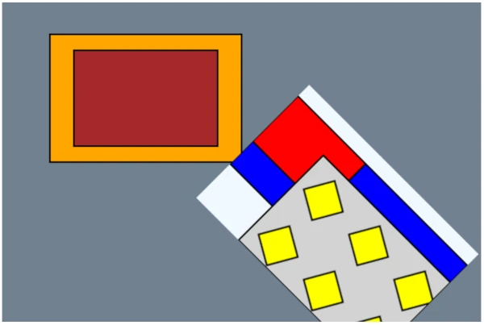

# Scrawl-canvas Groups and Cells
Scrawl-canvas works by generating a **retained mode** description - an object model of graphical primatives (called entitys) - for a scene which displays in a `<canvas>` element. SC builds this [scene graph](https://en.wikipedia.org/wiki/Scene_graph) using Group and Cell objects, alongside entity objects which get gathered into the Group objects that have been created for the scene.

> **tl;dr: *SC is not a game engine!*** The SC scene graph does not use the classic [tree structure](https://en.wikipedia.org/wiki/Tree_(abstract_data_type)) approach to build out a top-down hierarchy of layers and nodes to describe the scene. Rather, SC uses a more bottom-up approach to creating the scene graph where entity objects control how, where and when they will appear in the canvas display. Using a tree structure for the scene graph may have been a more efficient design choice, but *SC is not a game engine!*
> 
> Dev-users should be aware that this - *somewhat different* - approach may take a bit of getting used to but, once the concepts are in place, it should be relatively simple to work with.

## The SC scene graph
The following code creates a canvas display with this output. Note that the code is creating a deliberately complex scene-graph, for demonstration purposes; none of the test demos generate scene graphs as complex as this one:



```
<!DOCTYPE html>
<html>
  <head>
    <meta charset="utf-8">
    <meta http-equiv="x-ua-compatible" content="ie=edge">
    <meta name="viewport" content="width=device-width, initial-scale=1">
    <style>
      canvas { margin: 1em auto; }
    </style>
  </head>
  <body>
    <canvas 
      id="my-canvas"
      width="600"
      height="400"
      data-scrawl-canvas
      data-base-background-color="slategray"
    ></canvas>

    <script type="module">
      // Import SC
      import * as scrawl from 'scrawl-canvas';

      // Get a handle to the Canvas artefact
      const canvas = scrawl.findCanvas('my-canvas');

      // Namespacing boilerplate
      const namespace = `${canvas.name}-placehold`;
      const name = (n) => `${namespace}-${n}`;

      // The Canvas artefact includes a hidden Cell, used as a Pattern style by an entity
      canvas.buildCell({
          name: name('my-hidden-cell'),
          shown: false,
          dimensions: [80, 80],
          backgroundColor: 'lightgray',
      });

      // A yellow Block in the hidden Cell
      scrawl.makeBlock({
          name: name('yellow-block'),
          group: name('my-hidden-cell'),
          dimensions: ['50%', '50%'],
          start: ['center', 'center'],
          handle: ['center', 'center'],
          roll: 30,
          fillStyle: 'yellow',
          lineWidth: 2,
          method: 'fillThenDraw',
      });

      // An extra Cell that will appear towards the bottom-right of the canvas display
      canvas.buildCell({
          name: name('my-extra-cell'),
          dimensions: ['50%', '50%'],
          start: ['70%', '70%'],
          handle: ['50%', '50%'],
          roll: 45,
          backgroundColor: 'aliceblue',
      });

      // The extra Cell has an additional Group as well as its namesake Group
      scrawl.makeGroup({
          name: name('my-additional-group'),
          host: name('my-extra-cell'),
      });

      // Part of the additional Group
      scrawl.makeBlock({
          name: name('blue-block'),
          group: name('my-additional-group'),
          dimensions: ['100%', '60%'],
          offsetY: 20,
          fillStyle: 'blue',
          lineWidth: 2,
          method: 'fillThenDraw',
      });

      // For this scene, the extra Cell's namesake Group
      // needs to compile after its additional Group
      scrawl.findGroup(name('my-extra-cell')).set({ order: 1 });

      // Part of the extra Cell's namesake Group
      scrawl.makeBlock({
          name: name('red-block'),
          group: name('my-extra-cell'),
          pivot: name('blue-block'),
          lockTo: 'pivot',
          dimensions: ['40%', '40%'],
          fillStyle: 'red',
          lineWidth: 2,
          method: 'fillThenDraw',
      });

      // Part of the extra Cell's namesake Group
      // - using the hidden Cell as its fillStyle value
      scrawl.makeBlock({
          name: name('last-block'),
          group: name('my-extra-cell'),
          fillStyle: name('my-hidden-cell'),
          dimensions: ['75%', '75%'],
          start: ['25%', '25%'],
          lineWidth: 2,
          method: 'fillThenDraw',
      });

      // Part of the Canvas artefact's base Cell's namesake Group
      scrawl.makeBlock({
          name: name('orange-block'),
          dimensions: ['40%', '40%'],
          start: ['30%', '30%'],
          handle: ['center', 'center'],
          fillStyle: 'orange',
          lineWidth: 2,
          method: 'fillThenDraw',
      });

      // Part of the Canvas artefact's base Cell's namesake Group
      scrawl.makeBlock({
          name: name('black-block'),
          dimensions: ['30%', '30%'],
          pivot: name('orange-block'),
          lockTo: 'pivot',
          handle: ['center', 'center'],
          fillStyle: 'black',
          lineWidth: 2,
          method: 'fillThenDraw',
      });

      canvas.render();
    </script>
  </body>
</html>
```

The scene graph for the above code looks like this:

```
- Canvas artefact 'my-canvas'
  |
  |- base Cell object 'my-canvas_base'
  |  |
  |  |- namesake Group object 'my-canvas_base'
  |     |
  |     |- Block entity 'orange-block'
  |     |- Block entity 'brown-block' (position dependency on 'orange-block')
  |
  |- hidden Cell object 'my-hidden-cell'
  |  |
  |  |- namesake Group object 'my-hidden-cell'
  |     |
  |     |- Block entity 'yellow-block'
  |
  |- extra Cell object 'my-extra-cell'
     |
     |- additional Group object 'my-additional-group'
     |  |
     |  |- Block entity 'blue-block'
     |
     |- namesake Group object 'my-extra-cell'
        |
        |- Block entity 'red-block' (position dependency on 'blue-block')
        |- Block entity 'last-block' (style dependency on 'my-hidden-cell')
```

The scene graph described above demonstrates these properties:
+ The scene graph hierarchy is exactly four levels deep ...
  - Level 1 - Artefact objects,
  - Level 2 - Cell objects (relevant only for Canvas artefacts),
  - Level 3 - Group objects,
  - Level 4 - Entity objects.
+ Every Cell object has a namesake Group object.
+ Cells cannot be nested; Groups cannot be nested, etc.
+ Though only shown here for one Cell, every Cell, Group and Entity object can control its own visibility in the Canvas display.
+ Entitys are assigned to Groups (and Groups to Cells, Cells to the Canvas artifact) as they are created - the object lower down the hierarchy maintains details of the object it has assigned itself to.
+ Though not shown here ... Cell, Group and Entity objects can reassign themsleves to a different Canvas, Cell or Group object (respectively) at any time.
+ Again not shown here ... entitys can belong to more than one Group object at any time.
+ Furthermore not shown here ... Group objects can exist independently of Cell objects - they're just collections of entity objects.
+ Cell objects can position themselves in the Canvas display; Entity objects can position themselves in their Cell's display.
+ Group objects play no role in positioning - there is no "cascade of matrix multiplications" between Cells, Groups and entitys.
+ Some of the entitys have direct dependencies on other entitys for their positioning data, and one entity has a direcet dependency on a Cell to supply its fill style.
+ A final not shown here ... Entitys can change their positioning and/or styling dependencies at any time.

## SC Group objects
> **tl;dr:** Group objects represent a collection of SC artefact (including entity) objects - *and that is all they are!*

SC uses Group objects for a range of functionalities across the repo code base:
+ Every SC Stack artefact and Cell object is given a **namesake Group** when they are created, to which can be added other Artefact objects (for Stacks) or entity objects (for Cells) which need to be displayed in them.
+ (Note that SC Canvas artefacts do not have their own *namesake Group* as they only have one Cell object to worry about - their `base` Cell).
+ Dev users can create new Group objects at any time using the `scrawl.makeGroup({ key: value, ...})` factory function.
+ ***Stack artefacts and Cell objects can include more than one Group object*** - dev-users can add/remove their user-created Group objects to Stacks and Cells at any time. Any Element/entity objects included in the Group object will become part of the Stack/Cell output display.
+ For convenience, Element/entity objects belonging to a Group object can have their attributes modified at any time via Group object functions.
+ Group objects can be used to define the set of Element/entity objects which can be dragged-and-dropped as part of a `dragZone` object. See test demo [Canvas-026](../demo/canvas-026.html) for an example.
+ Group objects can be used to define a set of entity objects to which a [filter effect](sc-filter-engine.html) can be applied.

Most of the code relating to Group object functionality can be found in the following files:
+ [factory/group.js](../source/factory/group.html) - for the Group object's factory function.
+ [mixin/cascade.js](../source/mixin/cascade.html) - used by Stack and Cell objects to help manage their Group objects.

### Create, serialize, clone and kill Group objects
For the most part, Group objects act like regular SC objects, with a few quirks ...

#### Create
A new Group object can be created using the `scrawl.makeGroup({key: value, ...})` factory function:
+ While Group objects can share a `name` attribute with a Stack artefact or Cell object, dev-users should try to keep Group names unique - just to be on the safe side.
+ Group objects do not need to be associated with a Stack artefact or Cell object `host`, but when they are being created specifically to be part of such objects then include the `host` attribute in the argument object, setting its value to either the host object itself, or the object's `name` string.
+ Element artefacts and entity objects can be added to the Group during its creation by setting the argument object's `artefacts` attribute to an array of Element/entity `name` strings; alternatively, populate the Group with Element/entity objects after Group creation completes - `scrawl.makeGroup({...}).addArtefacts(item, item, ...)`.

#### Serialize
Group objects can be serialized using the `group.saveAsPacket()` function. The serialized packet will include all the currently associated artefact/entity object `name` strings in the `artefacts` attribute, but will not clone the artefacts themselves.

(TODO: Repo-devs need to review how Group serialization should work with respect to associated artefacts and entitys - should there be a mechanism in the functionality to tell the `group.saveAsPacket()` invocation to serialize associated objects at the same time as it serializes the Group object?)

#### Clone
Group objects can be created from another Group by cloning: `group.clone({key: value, ...})`. 

The cloned Group object will include the currently associated artefact/entity object `name` strings in the `artefacts` attribute, but will not clone those objects themselves. 

This may lead to issues if the Group is involved in the Display cycle as those objects will get stamped twice: once through association with the original Group, and again through association with the clone Group.

#### Kill
Use the `group.kill()` function. Unlike (most) other SC objects, the Group `kill` function can take 1-2 boolean arguments which, when set to `true`, will also kill all the artefact/entity objects currently associated with the group:
+ `group.kill()`, `group.kill(false)` - remove the Group object from the SC ecosystem, leaving the associated artefact/entity objects untouched.
+ `group.kill(true)`, `group.kill(true, false)` - kill the Group object's associated artefact/entity objects before removing the Group object from the SC ecosystem. Any artefact elements will remain in the DOM.
+ `group.kill(true, true)` - the same as `group.kill(true)`, except this time artefact elements will also be deleted from the DOM.

Group objects also include functionality to kill all their currently associated artifact/entity objects while keeping the Group object itself intact:
+ `group.killArtefacts()`, `group.killArtefacts(false)` - any artefact elements will remain in the DOM
+ `group.killArtefacts(true)` - any artefact elements will be deleted from the DOM

### Group discovery in the SC library, and beyond
Group objects are tracked in the SC library, in the `library.group` section. If the dev-user needs to retrieve a handle to a Group object, and they know the object's name attribute, they can do this using `scrawl.findGroup('name-string')`.

SC also includes functionality for the dev-user to retrieve Group objects via their Stack/Canvas artefact host object, and from Cell objects:
+ `stack.getGroup()` - retrieve the Stack artefact's *namesake* Group object.
+ `stack.get('groups')` - get an Array of Group name strings currently associated with the Stack artefact.
+ `canvas.get('baseGroup')` - retrieve the Canvas artefact's `base` Cell object's Group object.
+ `cell.getGroup()` - retrieve the Cell object's *namesake* Group object.
+ `cell.get('groups')` - get an Array of Group name strings currently associated with the Cell object.

### Add Group objects to Stack/Cell objects, and remove them
There's three approaches to associating a Group object with a Stack artefact or Cell object. The simplest method is during Group instantiation, by including a `host` attribute in the `scrawl.makeGroup()` factory function's argument object.

Dev-users can also use the `stack.addGroup(...items)` and `cell.addGroup(...items)` functions, where either the `name` attribute strings of the Group objects, or the Group objects themselves, are used as the function's arguments. Similarly, remove Group objects using the `stack.removeGroup(...items)` and `cell.removeGroup(...items)` functions.

SC recommends that dev-users avoid the `stack.set({ group })`, `cell.set({ group })` options because: only one group can be handled using this approach; and the operation will clear out all other associated Groups (including the *namesake* Group) before associating the new Group object.

### Group visibility, order and sorting
*The following only applies to Group objects associated with Cell objects that are part of the Display cycle.*

Group objects include a `visibility` attribute which, when set to `false`, will cause the Display cycle to skip over processing all of the artefacts/entitys associated with that Group - they will not recalculate their state, and they will not be stamped into the final Canvas display.

Group objects also include an `order` attribute, which should be set to a positive integer value (default: `0`). Entitys associated with a Group will all be processed on a per-group basis, with the artefacts in a Group with a lower `order` value completing their processing before the next group of entitys start their processing.

Cell objects store the `name` strings of the Group objects associated with them in an Array keyed to their `cell.groups` attribute. As part of any sorting operation, the Cell object will retrieve the Group objects from the SC library, sort these objects in ascending `order` values and then store references to the now sorted Group objects in an internal `cell.groupBucket` Array. The `groups` Array should never itself be sorted as this represents the order in which Groups get associated with the Cell - which is itself determined in the the code written by dev-users.

Cell objects only re-sort their Group objects when they have to:
+ During the first Display cycle
+ When a new Group object is added to the Cell object's `groups` Array
+ When a Group object is removed from the Cell object's `groups` Array
+ When a Group object updates its `order` attribute's value

Whenever any of these things happen, the Cell object's `batchResort` flag will be set to `true`, thus triggering a re-sort on the next Display cycle. SC uses a simple [bucket sort algorithm](https://en.wikipedia.org/wiki/Bucket_sort) for the sorting operation. Much of this functionality gets defined in the [mixin/cascade.js](../source/mixin/cascade.html) file.

(Repo-dev note: current functionality is that when a Group object's `order` value changes - via a `group.set({order: newValue})` invocation - the Group will only signal the change to its current host Cell object. This may cause unexpected outcomes (edge cases) for more complex dev-user projects and may need to be revisited at some point.)

(Repo-dev note: Group object visibility for Stack Element artefacts has not been investigated or tested, even though the functionality is - in theory - present. Needs review.)

### Add artefact/entity objects to Group objects, and remove them
Artefact/entity objects can be added to, and removed from, a Group object after it has been created by using the following functions:
+ `group.addArtefacts(item, item, ...)` - associate the artefact/entity object with the Group object, where each item may be the Artefact/entity object's `name` attribute value, or the Artefact/entity object itself.
+ `group.moveArtefactsIntoGroup(item, item, ...)` - similar to `addArtefacts`, except the artefact/entity objects being associated with the Group object will at the same time disassociate from any Group object they currently associate with.
+ `group.removeArtefacts(item, item, ...)` - the opposite of `addArtefacts`; here each artefact/entity object will disassociate itself from the Group object.
+ `group.clearArtefacts()` - the Group object instructs all of its associated artefact/entity objects to disassociate from it.

These operations have to be invoked on the Group object itself; SC does not supply convenience functions for the Stack artefact or Cell object to feed through arguments to their *namesake* Group objects.

Dev-users can retrieve a specified artefact/entity object from a Group object using the `group.getArtefact('name-string')` function.

#### Artefact sorting
The functionality previously described for Group ordering and sorting within Cell objects also applies to sorting artefact/entity objects within Group objects:
+ Group objects store the `name` strings of the artefact/entity objects associated with them in an Array keyed to their `group.artefacts` attribute. This Array is never sorted as it represents the order in which artefacts/entitys get associated with the Group.
+ Artefact/entity objects have two sort-related attributes (equivalent to the `group.order` attribute):
  - `entity.calculateOrder` - representing the artefact/entity's processing position during the `preStamp` (state recalculation) phase of the Display cycle's `compile` operation.
  - `entity.stampOrder` - representing the artefact/entity's processing position during the `stamp` phase of the Display cycle's `compile` operation.
+ Which means that when a Group object re-sorts its associated artefact/entity objects, it will perform two sorts:
  - the results of the `calculateOrder` sort are stored in the internal `group.artefactCalculateBuckets` Array.
  - the results of the `stampOrder` sort get stored in the `group.artefactStampBuckets` Array.

Group objects only sort their artefact/entity objects when they have to, signalled through the `group.batchResort` flag. This flag gets set to `true` when:
+ The Group object is first created
+ When a new artefact/entity object is added to the Group object's `artefacts` Array
+ When a artefact/entity object is removed from the Group object's `artefacts` Array
+ When an associated artefact/entity object updates its `calculateOrder` or `stampOrder` attribute's value (both of which can be set to the same value using the `order` pseudo-attribute)

SC uses a bucket-sort algorithm to perform these sort operations. Both sorts are handled in a single internal function - `group.sortArtefacts()` - defined in the [factory/group.js](../source/factory/group.html) file.

(Repo-dev note: current functionality is that when an artefact/entity object's `calculateOrder` or `stampOrder` value changes, the artefact/entity will only signal the change to its current host Group object. This may cause unexpected outcomes (edge cases) for more complex dev-user projects and may need to be revisited at some point.)

### Batch update artefact/entity object attributes using Group object functions
Any SC *tracked object* (an object that inherits functionality from the `mixin/base.js` file) can have its attributes updated at any time using its `.set({key: value, ...})` and `.setDelta({key: value, ...})` functions. 

SC Group objects include functions that allow such updates to be applied to all of their artefact/entity objects in a single invocation:
+ `group.setArtefacts({key: value, ...})` - the Group object will, for each of its associated artefact/entity objects, invoke their `set()` function with the same argument that it received. 
+ `group.updateArtefacts({key: value, ...})` - the Group object will, for each of its associated artefact/entity objects, invoke their `setDelta()` function with the same argument that it received.

> **tl;dr:** The difference between `set` and `setDelta` is:
> + `set({key: value}, ...)` - **replaces** each keyed attribute with the new value.
> + `setDelta({key: value}, ...)` - for each keyed attribute, **adds** the new value to the existing value.

#### Delta manipulations
SC `delta` animation is explained in the [Animation and Display cycle](sc-animation-systems.html) page of this Runbook. Group objects can be used to trigger delta updates across all of their associated artefact/entity objects using the following functions - even when delta animation for that artefact/entity object has been disabled:
+ `group.updateByDelta()` - **add** the keyed attribute values in the artefact/entity object's `delta` attribute object to its existing attribute values.
+ `group.reverseByDelta()` - **subtract** the keyed attribute values in the artefact/entity object's `delta` attribute object to its existing attribute values.

#### Artefact class manipulations
Specifically for associated artefact objects, dev-users can add or remove CSS class labels to/from those objects' DOM elements using the following Group object functions - note that the function argument is a String of space-separated classNames:
+ `group.addArtefactClasses('css-classname-1 css-classname-2 ...')` - adds the supplied CSS classname strings to the end of the existing `artefact.classes` attribute.
+ `group.removeArtefactClasses('css-classname-1 css-classname-2 ...')` - removes each of the CSS classname strings from the existing `artefact.classes` attribute.

The actual update to the DOM elements doesn't happen straight away. Instead a `dirtyClasses` flag is set to `true`, which then gets actioned during the `show` operation of the Display cycle.

#### Stack artefact and Cell object equivalent functionality
The [mixin/cascade.js](../source/mixin/cascade.html) file, consumed by the Stack and Cell factory files, provides an equivalent set of manipulation functions which the dev-user can invoke on Stack artefact and Cell object instances. The functions pass their argument through to all of the Group objects currently associated with that Stack or Cell:
+ `cell.setArtefacts({key: value, ...})`
+ `cell.updateArtefacts({key: value, ...})`
+ `cell.updateByDelta()`
+ `cell.reverseByDelta()`
+ `cell.addArtefactClasses('css-classname-1 css-classname-2 ...')`
+ `cell.removeArtefactClasses('css-classname-1 css-classname-2 ...')`

### Apply visual filters to Groups containing entity objects
SC filters can be applied to entity objects at the Cell, Group and entity object level of the Display cycle. See test demo [Canvas-007](../../demo/canvas-007.html) for an example of this functionality in action. Details about filter operations can be found in the [SC filter engine](sc-filter-engine.html) page of this Runbook.

If the same set of filters need to be applied to several entity objects at the same time, those objects can be gathered together into their own Group object for processing. However dev-users should be aware of the limitations surrounding this approach:
+ The Group object must be associated with the Cell object where the entitys will be stamped.
+ The entitys will be stamped onto the Cell together, in a single operation - this means that if some of the entitys need to appear behind a non-filtered entity, while other entitys in the same Group need to appear in front of that entity, the operation will fail:
  - Either the dev-user will have to separate the entitys into two separate Group objects, with the unfiltered entity in additional Group object whose `order` value lies between that of the two filtered Groups;
  - Or the filters will need to be applied to each entity separately, at the entity level.

Note that while the Group object filtering functionality is very similar to Cell object and entity object functionality, it differs from them in several small-yet-key areas. Repo-devs need to be aware that changes in filter functionality in one of these three areas of the code base may need to be reflected in the other two areas.

## SC Cell objects
SC **Cell objects** wrap HTML `<canvas>` elements, and add functionality for managing and manipulating that canvas display. SC **Canvas artefact objects** also wrap HTML `<canvas>` elements, with added functionality. 

To understand the SC ecosystem, developers need to understand the differences between the SC Canvas and Cell objects:

```
                                             Canvas artefact        Cell object
--------------------------------------------------------------------------------------------
<canvas> element is part of the DOM?         Yes                    No
<canvas> element can be styled with CSS?     Yes                    No
Events can be added to <canvas> element?     Yes                    No
Responsible for accessibility behaviour?     Yes                    No
Responsible for responsiveness behaviour?    No                     Yes
Involvement in the SC Display cycle?         Final output only      Everything else
Display can be directly manipulated?         No                     Yes
Display can be filtered?                     CSS/SVG filters        CSS/SVG and SC filters
```

> **tl;dr:** When SC is instructed to manage a `<canvas>` element, it will generate the following:
> + A **display canvas**, which is the original `<canvas>` element wrapped into a *Canvas artefact object*
> + A **base Cell**, which is a new `<canvas>` element that SC creates and wraps into a *Cell object*

Most SC functionality revolves around the *base Cell*, with the *display canvas* limited to acting as the final destination for the base Cell's graphical output. By taking most canvas manipulation functionality away from the DOM `<canvas>` element, SC is able to achieve significant improvements in canvas-related performance, while minimising the impact of canvas-based displays and animations on [web page performance](https://developer.mozilla.org/en-US/docs/Learn_web_development/Extensions/Performance/What_is_web_performance).

Note that the ***hidden `<canvas>` elements*** that SC generates as part of its work are just normal `<canvas>` elements, created using the browser's `document.createElement('canvas')` function. It is because of this reliance on access to the `document` object (alongside a number of other things such as the SC event system requiring access to the web page DOM) that SC is limited, *by design*, to work only in the frontend browser.
+ SC has not been designed to run in [web workers](https://developer.mozilla.org/en-US/docs/Web/API/Web_Workers_API), and makes no use of web worker code in any part of its code base. The same goes for [WebAssembly](https://developer.mozilla.org/en-US/docs/WebAssembly).
+ SC deliberately avoids the [OffscreenCanvas API](https://developer.mozilla.org/en-US/docs/Web/API/OffscreenCanvas) as testing over the years has failed to demonstrate any significant speed/efficiency improvements for SC's specific requirements.
+ SC does not include any code to help it run successfully on the server side, or in native apps. Honestly, if dev-users want a graphics generator to run on the server, their best bet is to look at something like [Skia](https://skia.org/) (which has bindings for the [Rust](https://crates.io/crates/skia-safe), [Java](https://github.com/JetBrains/skija), [Scala](https://github.com/nornagon/scanvas), [Python](https://pypi.org/project/skia-python/), etc languages), or alternatively [Cairo](https://www.cairographics.org/), to create graphical output for downloading or streaming to the front end.

### Types of Cell objects
SC uses hidden `<canvas>` elements for a variety of different purposes, and codes them up in different ways:

#### Base Cells
`Base` Cell objects acts in concert with their display canvas; SC creates a base Cell every time it wraps a `<canvas>` element into a Canvas artefact wrapper and assigns the Cell object to the `canvas.base` attribute. The `base` Cell is the default painting area for the display canvas and, at the end of each Display cycle, copies itself into the display canvas.

Base Cells share a lot of functionality with layer Cells, with code defined in the [factory/cell.js](../source/factory/cell.html) and [mixin/cell-key-functions.js](../source/mixin/cell-key-functions.html) files.

Dev-users are strongly advised to not interfere with base Cell objects, unless they enjoy frustration!

#### Pool Cells
SC maintains a pool of hidden `<canvas>` elements, wrapped in **CellFragment** objects, for various internal purposes. These `pool` Cells are not tracked in the SC library, and are not available for dev-user use. 

CellFragment objects contain only the minimum functionality required so the Cells can perform their various jobs around the code base. The code for CellFragment objects, alongside the pool infrastructure, can be found in the [untracked-factory/cell-fragment.js](../source/untracked-factory/cell-fragment.html) file, with additional, shared functionality defined in the [mixin/cell-key-functions.js](../source/mixin/cell-key-functions.html) file.

SC uses `pool` Cell objects extensively through the code base. Repo-devs retrieve a Cell from the pool using the `requestCell()` function, and return it using the `releaseCell(object)` function. When returned to the pool, the CellFragment objects and their `<canvas>` elements will be cleaned back into a default state. **Note that failing to return a pool Cell will lead to memory leaks**:
+ [asset-management/reaction-diffusion-asset.js](../source/asset-management/reaction-diffusion-asset.html) - used to help create the initail conditions for an RD-asset, where the asset will build around an entity outline.
+ [factory/cell.js](../source/factory/cell.html) - used to help create a [ghosting effect](https://brush.ninja/glossary/animation/ghosting/) in a canvas animation. Also used to help calculate a layer Cell's `localHere` object's values, and to help stash a Cell object's `<canvas>` output as part of the `scrawl.createImageFromCell(cell, flag)` function.
+ [factory/crescent.js](../source/factory/crescent.html) - used to help calculate the intersection points of the two circles that make up the crescent shape.
+ [factory/emitter.js](../source/factory/emitter.html) - used for calculating if a proposed particle is within an entity area.
+ [factory/enhanced-label.js](../source/factory/enhanced-label.html) - used extensively throughout the file, which needs a number of `pool` Cells to help it create the entity's output.
+ [factory/grid.js](../source/factory/grid.html) - used to help build the Grid entity's display output.
+ [factory/group.js](../source/factory/group.html) - used as part of the Group graphical filter functionality.
+ [factory/label.js](../source/factory/label.html) - used to help draw Label underlines.
+ [factory/loom.js](../source/factory/loom.html) - used to help build the Loom entity's display output.
+ [factory/mesh.js](../source/factory/mesh.html) - used to help build the Mesh entity's display output.
+ [helper/filter-engine.js](../source/helper/filter-engine.html) - the SC filter engine uses pool Cells to help calculate gradient effects. 
+ [mixin/dom.js](../source/mixin/dom.html) - SC Stack and Element artefacts use a pool Cell for their `checkHit(...)` functionality.
+ [mixin/entity.js](../source/mixin/entity.html) - SC entity objects use the Cell to help add graphical filter effects to entity outputs.
+ [mixin/filters.js](../source/mixin/filters.html) - used to help import assets into the filter engine.
+ [mixin/position.js](../source/mixin/position.html) - SC uses pool Cells for entity `checkHit(...)` functionality.
+ [mixin/text.js](../source/mixin/text.html) - used to help calculate font metadata.

#### Layer Cells
A canvas scene can include multiple Cell objects alongside the `base` Cell. Each of these `layer` Cell objects will include a *namesake* Group object with which entity objects can associate themselves, to be included in the `layer's` output which will be stamped onto the `base` Cell as part of the `show` operation of the Display cycle.

Dev-users can add a new `layer` Cell to a canvas at any time using the `canvas.buildCell({key: value, ...})` function. Be aware that the `base` Cell will stamp its own entitys into its display before stamping the `layer` Cell output on top.

`Layer` Cells are highly versatile containers. Dev-users can:
+ Define which parts of the Display cycle each `layer` will participate in, by setting the Cell's `cleared`, `compiled` and `shown` flags.
+ Determine the order in which `layer` Cells are processed during a Display cycle, using the Cell's `compileOrder` and `showOrder` attributes.
+ Use the Canvas artefact, or `base` Cell, object dimensions to set their dimensions (with help from the `setRelativeDimensionsUsingBase` flag).
+ Position them in the `base` Cell in the same way as entity objects can be positioned, using absolute and relative coordinates. They also have their own rotation-reflection points around which they can be rotated, scaled and flipped. See the [SC positioning system](sc-positioning.html) page in this Runbook for more details.
+ Position them by reference to other artefact/entity objects using pivot, mimic and path `lockTo` functionality - see test demo [Canvas-036](../../demo/canvas-036.html) for an example of this functionality in action.
+ Modify how they stamp into the `base` Cell's display through the `globalAlpha` (for opacity) and `globalCompositeOperation` (for composition) values.
+ Add filter effects to the `layer` Cell's output.
+ Use the `layer` Cell output as an image asset for SC Pattern styles and the Picture entity.
+ Use the `layer` Cell directly as a style value for the `entity.fillStyle` and `entity.strokeStyle` attributes.

### Create, serialize, clone and kill Cell objects
[write up]

### The Cell engine
[write up]

#### Cell dimensions
[write up]

#### Cell backgrounds
[write up]

#### Cell display manipulation - the `splitShift()` function
[write up]

#### Cell data manipulation - the `getCellData()` and `paintCellData()` functions
[write up]

### Display cycle considerations
Write up:
+ clear functionality
+ compile functionality
+ show functionality
+ cleared, compiled and shown flags 
+ compileOrder, showOrder

### Cell state
[write up]

### Cell interactions
Write up:
+ Local here
+ Entity hover detection

### Layer cell considerations
Write up:
+ Cell positioning
  - dimensions, setRelativeDimensionsUsingBase
  - absolute and relative positioning
  - position by reference considerations
  - lockTo
  - Rotations and flips
+ Cell opacity
+ Cell composition
+ Applying filters to Cells

### Using Cells as Pattern assets
[write up]

## Object processing order within the scene graph
When the dev-user adds `pivot`, `mimic`, and `path` references into their SC code (see the [positioning system](sc-positioning.html) page for details), they also introduce **artefact dependencies**: if an artefact depends on another artefact to calculate some part of its own display (position, rotation, dimensions, scale), then the need arises for the referenced artefacts to complete their calculations for those attributes before the dependant artefact begins its own calculations.

> **tl;dr: - SC includes no functionality to internally construct and maintain a [dependency graph](https://en.wikipedia.org/wiki/Dependency_graph)** describing which artefacts need to calculate values before dependent artefact can calculate theirs. It is up to the dev-user to tell SC the order in which artefacts should calculate/update their state.

The [SC Display cycle](sc-animation-systems.html) comprises the following steps:

```
1: Clear operation

2: Compile operation
   2.1: Calculate phase
   2.2: Stamp phase

3: Show operation
```

A number of attributes are used across the code base to describer ordering; it's important not to confuse them:

+ SC ***Cell*** artefacts use their `compileOrder` and `showOrder` attributes to determine in which order they will perform the Display cycle compile and show steps.

+ SC ***Group*** objects have an `order` attribute which comes into play when two or more Groups contribute entitys to a Cell's display.

+ SC ***Artefacts*** have `calculateOrder` and `stampOrder` attributes (which can both be set to the same value using the `order` pseudo-attribute).

To understand ordering, consider the code presented in the scene graph section above. But this time the factory functions have been rearranged in the file as shown:

```
canvas.buildCell({
  name: name('my-extra-cell'),
  backgroundColor: 'aliceblue',
  ...
});

scrawl.makeGroup({
  name: name('my-additional-group'),
  host: name('my-extra-cell'),
});

canvas.buildCell({
  name: name('my-hidden-cell'),
  shown: false,
  backgroundColor: 'lightgray',
  ...
});

scrawl.makeBlock({
  name: name('yellow-block'),
  group: name('my-hidden-cell'),
  fillStyle: 'yellow',
  ...
});

scrawl.makeBlock({
  name: name('brown-block'),
  pivot: name('orange-block'),
  fillStyle: 'brown',
  ...
});

scrawl.makeBlock({
  name: name('orange-block'),
  fillStyle: 'orange',
  ...
});

scrawl.makeBlock({
  name: name('blue-block'),
  group: name('my-additional-group'),
  fillStyle: 'blue',
  ...
});

scrawl.makeBlock({
  name: name('red-block'),
  group: name('my-extra-cell'),
  pivot: name('blue-block'),
  fillStyle: 'red',
  ...
});

scrawl.makeBlock({
  name: name('last-block'),
  group: name('my-extra-cell'),
  fillStyle: name('my-hidden-cell'),
  ...
});
```

The SC Display cycle will process the above code in the following order:

```
Canvas {name: 'my-canvas'}

  Cell {name: 'my-extra-cell', compileOrder: 0, shown: true}

    Group {name: 'my-extra-cell', order: 0}

      Block {
        name: 'red-block', lockTo: 'pivot', pivot: 'blue-block', 
        calculateOrder: 0, stampOrder: 0,
      }

      Block {
        name: 'last-block', lockTo: 'start', fillStyle: 'my-hidden-cell', 
        calculateOrder: 0, stampOrder: 0,
      }

    Group {name: 'my-additional-group', order: 0}
  
      Block {
        name: 'blue-block', lockTo: 'start', 
        calculateOrder: 0, stampOrder: 0,
      }

  Cell {name: 'my-hidden-cell', compileOrder: 0, shown: false}

    Group {name: 'my-hidden-cell', order: 0}
    
      Block {
        name: 'yellow-block', lockTo: 'start', 
        calculateOrder: 0, stampOrder: 0,
      }

  Cell {name: 'my-canvas_base', compileOrder: 9999}

    Group {name: 'my-canvas_base'}

      Block {
        name: 'brown-block', lockTo: 'pivot', pivot: 'orange-block', 
        calculateOrder: 0, stampOrder: 0,
      }

      Block {
        name: 'orange-block', lockTo: 'start', 
        calculateOrder: 0, stampOrder: 0,
      }
```

**my-extra-cell**

1. `red-block` - has a ***pivot*** dependency on `blue-block`
2. `last-block` - has a ***stamp*** dependency on `my-hidden-cell`
3. `blue-block` - has no dependencies

**my-hidden-cell**

4. `yellow-block` - has no dependencies

**my-canvas_base**

5. `brown-block` - has a ***pivot*** dependency on `orange-block`
6. `orange-block` - has no dependencies

... Which will lead to an incorrect canvas output:

| Original code output | Rearranged code output |
|---|---|
|||

To fix this, the dev-user can either: 
+ Rearrange the factory functions to get SC to process them in the desired order (because: when SC objects have the same order values, SC will process them in the order they were declared in the code)
+ Tell SC the order in which the Cell, Group and Block objects should be processed by setting their `compileOrder` / `order` values, as follows:

```
// The 'my-extra-cell' Cell needs to compile after 'my-hidden-cell'
canvas.buildCell({
  name: name('my-extra-cell'),
  ...
  compileOrder: 1,
});

// The 'my-extra-cell' namesake Group needs to compile after 'my-additional-group'
scrawl.findGroup('my-extra-cell').set({ order: 1 });

scrawl.makeGroup({
  name: name('my-additional-group'),
  host: name('my-extra-cell'),
});

canvas.buildCell({
  name: name('my-hidden-cell'),
  ...
});

scrawl.makeBlock({
  name: name('yellow-block'),
  group: name('my-hidden-cell'),
  fillStyle: 'yellow',
  ...
});

// This block needs to calculate and stamp after its pivot
scrawl.makeBlock({
  name: name('brown-block'),
  pivot: name('orange-block'),
  ...
  order: 1,
});

scrawl.makeBlock({
  name: name('orange-block'),
  fillStyle: 'orange',
  ...
});

scrawl.makeBlock({
  name: name('blue-block'),
  group: name('my-additional-group'),
  fillStyle: 'blue',
  ...
});

scrawl.makeBlock({
  name: name('red-block'),
  group: name('my-extra-cell'),
  pivot: name('blue-block'),
  fillStyle: 'red',
  ...
});

scrawl.makeBlock({
  name: name('last-block'),
  group: name('my-extra-cell'),
  fillStyle: name('my-hidden-cell'),
  ...
});
```

Now the SC Display cycle processes the code like this:
```
Canvas {name: 'my-canvas'}

  Cell {name: 'my-hidden-cell', compileOrder: 0, shown: false}

    Group {name: 'my-hidden-cell', order: 0}

      Block {
        name: 'yellow-block', lockTo: 'start', 
        calculateOrder: 0, stampOrder: 0,
      }

  Cell {name: 'my-extra-cell', compileOrder: 1, shown: true}

    Group {name: 'my-additional-group', order: 0}

      Block {
        name: 'blue-block', lockTo: 'start', 
        calculateOrder: 0, stampOrder: 0,
      }

    Group {name: 'my-extra-cell', order: 1}

      Block {
        name: 'red-block', lockTo: 'pivot', pivot: 'blue-block', 
        calculateOrder: 0, stampOrder: 0,
      }

      Block {
        name: 'last-block', lockTo: 'start', fillStyle: 'my-hidden-cell', 
        calculateOrder: 0, stampOrder: 0,
      }

  Cell {name: 'my-canvas_base', compileOrder: 9999}

    Group {name: 'my-canvas_base'}

      Block {
        name: 'orange-block', lockTo: 'start', 
        calculateOrder: 0, stampOrder: 0,
      }

      Block {
        name: 'brown-block', lockTo: 'pivot', pivot: 'orange-block', 
        calculateOrder: 1, stampOrder: 1
      }
```

Which will lead to the expected outcome:

**my-hidden-cell**

1. `yellow-block` - has no dependencies

**my-extra-cell**

2. `blue-block` - has no dependencies
3. `red-block` - has a ***pivot*** dependency on `blue-block`
4. `last-block` - has a ***stamp*** dependency on `my-hidden-cell`

**my-canvas_base**

5. `orange-block` - has no dependencies
6. `brown-block` - has a ***pivot*** dependency on `orange-block`
