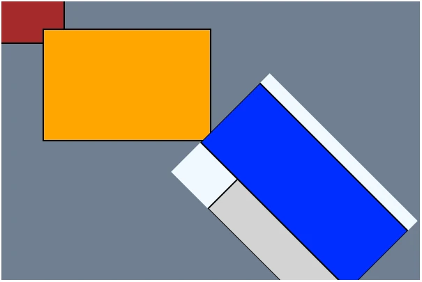

# The Scrawl-canvas positioning system
The key purpose of SC is to position graphical entitys onto a `<canvas>` element, in a given order, so that those entitys build some form of graphical representation, chart, imagery, infographic, artwork (etc) that can be displayed as part of a web page.

Most of the code associated with the SC positioning system can be found in the [mixin/position.js](../source/mixin/position.html) mixin file.

## Background
As background knowledge, we need to understand that a DOM `<canvas>` element, and SC's representation of that element (as `Canvas` and `Cell` wrapper artefacts) are very different things.

+ **DOM `<canvas>` elements** are part of the HTML5 specification. The element includes attributes - `height=`, `width=` - used to define a ***coordinate space*** (measured in CSS pixels) within which drawing operations can take place. The visual representation of the canvas element in the web page can be styled using CSS; note that when the element's CSS styling dimensions diverge from its coordinate space dimensions, browsers will scale the coordinate space (ignoring aspect ratio) to fit into the styled dimensions. Drawing operations are, for 2D graphics, defined by the [Canvas API](https://developer.mozilla.org/en-US/docs/Web/API/Canvas_API); these operations are managed by a [context interface](https://developer.mozilla.org/en-US/docs/Web/API/CanvasRenderingContext2D). 

+ **SC Canvas artefacts** wrap DOM `<canvas>` elements and bring them into the SC ecosystem. They include handles to the DOM element itself and its context interface, though dev-users should generally avoid directly interacting with them. Instead, graphical operations are handled by Cell artefacts, of which each Canvas wrapper will have at least one - the ***base Cell***. Dev-users can control how the base cell will display in the DOM `<canvas>` element, allowing us to build real-time responsive graphical displays.

+ **SC Cell artefacts** wrap regular (auto-generated) `<canvas>` elements that are **not** added to the web page's DOM. Every Canvas wrapper includes, at a minimum, a ***base Cell***, and can include additional Cell artefacts as necessary. Note that these additional `<canvas>` elements are nothing special: SC does not make use of the [OffscreenCanvas interface](https://developer.mozilla.org/en-US/docs/Web/API/OffscreenCanvas) or, indeed, Web Workers.

> **tl;dr: We only need to care about Cell artefact dimensions.** All SC graphical operations happen in Cell artefacts and end up in the Canvas artefact's base Cell. Every Cell we create will have its own dimensions - a ***cell coordinate space*** - which can diverge from the associated DOM `<canvas>` element's dimensions. Canvas artefacts handle the transfer of graphical data from their base Cell to their DOM `<canvas>` element automatically.

From this point on:
+ When we refer to `Cell` we (generally) mean an SC Canvas artefact's base Cell artefact.
+ A `host coordinate system` is the Cell artefact's coordinate space.
+ `Entitys` refer to graphical objects which can be stamped onto a Cell.
+ A `local coordinate system` is a coordinate system specific to a given entity.

Furthermore, **positioning** refers to the *location* of an entity on the Cell, alongside that entity's *dimensions*, *scale* (relative to its default dimensions) and *rotation* (relative to the Cell's coordinate space axes).

Also, while we concentrate on the positioning of graphical entitys in this document, SC extends the positioning system to include DOM elements within an SC "stack" element.

### The rotation-reflection point
When we position an entity, we are in fact positioning that entity's ***rotation-reflection*** point, around which the entity will stamp itself onto the Cell.

By default, the rotation-reflection point is located at the top-left corner of the entity, and represents the `[0, 0]` coordinate of that entity's local coordinate system.

We position this rotation-reflection point in the Cell's host coordinate system, which starts at the Cell's top left corner and extends the width (x axis) and height (y axis) of its drawing space. 

SC allows us to position an entity's rotation-reflection point in several different ways:

+ ***Absolute positioning*** using pixel coordinates (`[x, y]`) relative to the Cell's top-left corner - for example `[50, 50]` represents a position 50px from the Cell's left border and 50px from the top border.

+ ***Relative positioning*** using percentage ratio coordinates (`['x%', 'y%']`) relative to the Cell's current width and height dimensions - for example `['50%', '50%']` represents a position at the centre of the Cell.

+ ***Positioning by reference*** where an entity can use the current position of another entity to calculate its own position on the Cell.

## Absolute and relative positioning
The most direct way to position an entity is to give it `start`, `offset` and `handle` values, from which it will calculate its position on the Cell. Each of these attributes are Coordinates with a default value of `[0,0]`. Each atteribute also comes with a set of pseudo-attributes which allow the dev-user to set and get the x and y components of the Coordinate separately.

### The `start` artefact attribute
We **set** an artefact's rotation-reflection point using its `start` attribute. For convenience, we can also set each part of the point's coordinate using the `startX` and `startY` pseudo-attributes.

We can mix-and-match absolute and relative values in a coordinate: `[200, '40%']` is a legitimate coordinate, as is `['40%', 200]`.

Setting an artefact's `start` attribute will also set the artefact's `dirtyStart` boolean flag to `true`. At the start of the next [Display cycle](sc-display-cycle.html) the SC system performs a check across all entitys and, for those marked dirty, will perform calculations to ***clean*** their `start` attribute, placing the result (measured in cell coordinate space pixels) into the private `currentStart` attribute.

When we **get** an artefact's `start` coordinate, the `currentStart` attribute will be returned. Note that any attempt to ***set*** the `currentStart` will have unexpected effects on the artefact.

Directly setting an artefact's `start` or (worse!) `currentStart` value will lead to unexpected behaviours and bugs. Always use the `artefact.set({ start: [x, y]})` or `artefact.deltaSet({ start: [x, y]})` functionality!

### The `offset` and `position` artefact attributes
An artefact's `start` (and `currentStart`) value does not fully represent its rotation-reflection point. We are able to ***offset*** the rotation-reflection point from the start coordinate using the artefact's `offset` attribute. See [Demo Canvas-002](../demo/canvas-002.html) for an example of this functionality.

These `offset` values, like `start` values, can be ***absolute*** (measured in pixels) or ***relative*** (as a percentage of the host Cell's current dimensions). When we **set** the artefact's `offset` (`offsetX`, `offsetY`) value, we also set its `dirtyOffset` boolean flag to `true`. Similar to the `start` attribute, entitys will clean their dirty offsets and store the result in the private `currentOffset` attribute.

When we **get** an artefact's `offset` coordinate, the `currentOffset` value will be returned. Note that any attempt to ***set*** the `currentOffset` will have unexpected effects on the artefact.

We can **get** an artefact's current rotation-reflection coordinate at any time using the `position` pseudo-attribute; the `positionX` and `positionY` pseudo-attributes are also supported. Note that any attempt to ***set*** these pseudo-attributes will have no effect on the artefact.

```
{0,0} host coordinate system
    .---------|---------|---------|---------|---------.
    |                                                 |
    |    start        offset        handle            | @: start coordinate
    |    [10,5]       [5,2]         [0,0]             |
    |                                                 | o: rotation-reflection point
    |         @                                       | = currentStart + currentOffset
    |                                                 | = [10,5]       + [5,2]
    |              o---------+                        | = [15,7]
    |              |         | artefact width: 10     |
    |              |         | artefact height: 5     |
    -              |         | roll: 0                -
    |              |         | scale: 1               |
    |              +---------+                        |
    |                                                 | *: path-start-coordinate
    |    currentStart currentOffset currentHandle     | = rot-ref-point - (currentHandle * scale)
    |    [10,5]       [5,2]         [0,0]             | = [15,7]        - [0*1,0*1]
    |                                                 | = [15,7]        - [0,0]
    |                                                 | = [15,7]
    |                                                 |
    |                                                 |
    .---------|---------|---------|---------|---------.
                                                      {50,20}


{0,0} host coordinate system
    .---------|---------|---------|---------|---------.
    |                                                 |
    |    start         offset        handle           | @: start coordinate
    |    ['20%','50%'] ['10%','10%'] [0,0]            |
    |                                                 | o: rotation-reflection point
    |         @                                       | = currentStart + currentOffset
    |                                                 | = [10,5]       + [5,2]
    |              o---------+                        | = [15,7]
    |              |         | artefact width: 10     |
    |              |         | artefact height: 5     |
    -              |         | roll: 0                -
    |              |         | scale: 1               |
    |              +---------+                        |
    |                                                 | *: path-start-coordinate
    |    currentStart  currentOffset currentHandle    | = rot-ref-point - (currentHandle * scale)
    |    [10,5]        [5,2]         [0,0]            | = [15,7]        - [0*1,0*1]
    |                                                 | = [15,7]        - [0,0]
    |                                                 | = [15,7]
    |                                                 |
    |                                                 |
    .---------|---------|---------|---------|---------.
                                                      {50,20}

```

### The `handle` artefact attribute.
In brief, SC ***paints*** an artefact onto the canvas using the following protocol:
1. If necessary, clean the artefact's dirty attributes and recalculate its rotation-reflection point.
2. If necessary, recalculate the artefact's ***path2D object***, which will be used during the painting step to `fill` and/or `stroke` the artefact onto the Cell.
3. Position and rotate the host Cell's context engine using the Canvas API `setTransform()` function - it is at this moment that we move the Cell's engine's coordinate system origin point - `[0,0]` - to match the artefact's rotation-reflection point.
4. Update the Cell's engine state to match the artefact's engine state.
5. Stamp the artefact onto the Cell's DOM `<canvas>` element.

The `start` and `offset` attributes discussed above both feed into the first step of the protocol.

Every artefact has a [path2D object](https://developer.mozilla.org/en-US/docs/Web/API/Path2D), which SC uses for stroke/fill painting operations as well as the artefact's ***hit*** functionality (for example: hover, and drag-and-drop, operations).

When building the artefact's path2D object, SC takes into account the artefact's ***dimensions*** and ***scale***. It also includes a (scaled) ***local displacement*** value which has the apparent effect of moving the rotation-reflection point away from the artefact's top-left corner. Dev-users can set this displacement value in the artefact's `handle` attribute.

Similar to the `start` and `offset` values, `handle` values can be ***absolute*** (measured in pixels) or ***relative*** (as a percentage of the artefact's current scaled dimensions). When we **set** the artefact's `handle` (`handleX`, `handleY`) value, we also set its `dirtyHandle` boolean flag to `true`. After cleaning, the handle's calculated values get stored in the private `currentHandle` attribute.

When we **get** an artefact's `handle` coordinate, the `currentHandle` value will be returned. Note that any attempt to ***set*** the `currentHandle` will have unexpected effects on the artefact.

```
{0,0} host coordinate system
    .---------|---------|---------|---------|---------.
    |                                                 |
    |    start        offset        handle            | @: start coordinate
    |    [10,5]       [5,2]         [-4,1]            |
    |                                                 | o: rotation-reflection point
    |         @                                       | = currentStart + currentOffset
    |                  *---------+                    | = [10,5]       + [5,2]
    |              o   |         | artefact width: 10 | = [15,7]
    |                  |         | artefact height: 5 |
    -                  |         | roll: 0            |
    |                  |         | scale: 1           -
    |                  +---------+                    |
    |                                                 |
    |                                                 | *: path-start-coordinate
    |    currentStart currentOffset currentHandle     | = rot-ref-point - (currentHandle * scale)
    |    [10,5]       [5,2]         [-4,1]            | = [15,7]        - [-4*1,1*1]
    |                                                 | = [15,7]        - [-4,1]
    |                                                 | = [19,6]
    |                                                 |
    |                                                 |
    .---------|---------|---------|---------|---------.
                                                      {50,20}


{0,0} host coordinate system
    .---------|---------|---------|---------|---------.
    |                                                 |
    |    start        offset         handle           | @: start coordinate
    |    ['20%','50%'] ['10%','10%'] ['-40%','20%']   |
    |                                                 | o: rotation-reflection point
    |         @                                       | = currentStart + currentOffset
    |                  *---------+                    | = [10,5]       + [5,2]
    |              o   |         | artefact width: 10 | = [15,7]
    |                  |         | artefact height: 5 |
    -                  |         | roll: 0            |
    |                  |         | scale: 1           -
    |                  +---------+                    |
    |                                                 |
    |                                                 | *: path-start-coordinate
    |    currentStart currentOffset currentHandle     | = rot-ref-point - (currentHandle * scale)
    |    [10,5]       [5,2]         [-4,1]            | = [15,7]        - [-4*1,1*1]
    |                                                 | = [15,7]        - [-4,1]
    |                                                 | = [19,6]
    |                                                 |
    |                                                 |
    .---------|---------|---------|---------|---------.
                                                      {50,20}


```

## Positioning by reference
A foundational tenet of the SC positioning system is that any artefact can position itself on the Cell by referencing any other artefact. 

In essence, this means that instead of using its own `currentStart` values when calculating the value of its rotation-reflection point, our artefact will instead use the referenced artefact's `currentStart` values. SC manages this through a system of locks, alongside a (bespoke, and rudimentary) signals system.

### The `lockTo` artefact attribute
The `lockTo` attribute is an Array containing two String values. Each value indicates how the artefact wants to calculate its position along the Cell's `x` and `y` axes - `['x-axis-string', 'y-axis-string']`. The default value is `['start', 'start']`, indicating that the artefact wishes both parts of its start coordinate to use absolute or relative positioning as described above.

Like the other coordinate-like attributes, `lockTo` comes with a set of pseudo-attributes - `lockXTo`, `lockYTo` - which dev-users can use to set the individual elements of the attribute.

The following String values can be used in the `lockTo` attribute's Array:

+ `start` - (default): use absolute or relative positioning

+ `pivot`: use the referenced artefact's `currentStart` values to calculate the rotation-reflection point. Dev-users can reference an artefact by setting the artefact's `pivot` attribute to the artefact's name String, or the artefact itself.

+ `mimic`: use the referenced artefact's `currentStart` values to calculate the rotation-reflection point. Dev-users can reference an artefact by setting the artefact's `mimic` attribute to the artefact's name String, or the artefact itself, alongside setting its `useMimicStart` flag to `true`.

+ `path`: use a given position's coordinates along the referenced artefact's ***path*** to calculate the rotation-reflection point. Dev-users can reference a [path-based entity](sc-path-based-entitys.html) by setting our artefact's `path` attribute to the referenced entity's name String, or the referenced entity itself. The position along the path is a float Number between `0` and `1` set on our artefact's `pathPosition` attribute; note that this position can be affected by the value of the `constantSpeedAlongPath` boolean attribute - see [demo Canvas-030](../demo/canvas-030.html) for an example of this in action.

+ `particle`: use the referenced particle's current position to calculate the rotation-reflection point.

+ `mouse`: use the mouse cursor's calculated position relative to the Cell to calculate the rotation-reflection point

Dev-users are able to set an artefact to reference multiple artefacts, one each for the `pivot`, `mimic`, `path` and `particle` attributes. These attributes can be updated at any time. It is the `lockTo` attribute which determines which reference will be used to position the artefact.

#### Pivot specifics
+ If the referenced artefact is an ***Element*** artefact, the artefact is able to pivot to either the Element's start value, or to the position of any of the Element's current corner positions, depending on the value set on the artefact's `pivotCorner` attribute.

+ If the referenced artefact is a ***Polyline*** entity, the artefact is able to pivot to any of the Polyline's pins, set on the artefact's `pivotPin` attribute.

+ If the referenced artefact is an ***EnhancedLabel*** entity, the artefact is able to pivot to the EnhancedLabel's template artefact's start value, or to the position of a given textUnit within the EnhancedLabel, depending on the value set on the artefact's `pivotIndex` attribute.

+ If the artefact's `addPivotRotation` boolean flag is set to `true`, the artefact will add the referenced artifact's rotation value to its own rotation value.

+ If the artefact's `addPivotOffset` boolean flag is set to `true`, the artefact will add the referenced artifact's `currentOffset` value to its own offset value.

+ If the artefact's `addPivotHandle` boolean flag is set to `true`, the artefact will add the referenced artifact's `currentHandle` value to its own handle value.

#### Mimic specifics
Mimic functionality allows an artefact to mimic a range of the referenced artefacts attributes, as follows:

+ `start` - setting `useMimicStart` to `true` makes the artefact use the referenced artefact's start attribute; setting `addOwnStartToMimic` will add together both the artefact's and the referenced artefact's start values to generate the final result.

+ `offset` - setting `useMimicOffset` to `true` makes the artefact use the referenced artefact's offset attribute; setting `addOwnOffsetToMimic` will add together both the artefact's and the referenced artefact's offset values to generate the final result.

+ `handle` - setting `useMimicHandle` to `true` makes the artefact use the referenced artefact's handle attribute; setting `addOwnHandleToMimic` will add together both the artefact's and the referenced artefact's handle values to generate the final result.

+ `roll` - setting `useMimicRotation` to `true` makes the artefact use the referenced artefact's roll attribute; setting `addOwnRotationToMimic` will add together both the artefact's and the referenced artefact's roll values to generate the final result.

+ `dimensions` - setting `useMimicDimensions` to `true` makes the artefact use the referenced artefact's dimensions attribute; setting `addOwnDimensionsToMimic` will add together both the artefact's and the referenced artefact's dimensions values to generate the final result.

+ `scale` - setting `useMimicScale` to `true` makes the artefact use the referenced artefact's scale attribute; setting `addOwnScaleToMimic` will add together both the artefact's and the referenced artefact's scale values to generate the final result.

+ `flipReverse` and `flipUpend` - setting `useMimicFlip` to `true` makes the artefact use the referenced artefact's flipReverse and flipUpend boolean flags as part of its calculations.

#### Path specifics
+ If the artefact's `addPathRotation` boolean flag is set to `true`, the artefact will add the referenced path-based entity's rotation value to its own rotation value.

+ If the artefact's `addPathOffset` boolean flag is set to `true`, the artefact will add the referenced path-based entity's `currentOffset` value to its own offset value.

+ If the artefact's `addPathHandle` boolean flag is set to `true`, the artefact will add the referenced path-based entity's `currentHandle` value to its own handle value.

## Calculation order
When the dev-user adds `pivot`, `mimic`, and `path` references into their SC code, they also introduce **artefact dependencies**: if an artefact depends on another artefact to calculate some part of its own display (position, rotation, dimensions, scale), then the need arises for the referenced artefacts to complete their calculations for those attributes before the dependant artefact begins its own calculations.

> **tl;dr: - SC includes no functionality to internally construct and maintain a dependency graph** describing which artefacts need to calculate values before dependent artefact can calculate theirs. It is up to the dev-user to tell SC the order in which artefacts should calculate/update their state.

The SC Display cycle comprises the following steps:

```
1: Clear

2: Compile
   2.1: Calculate
   2.2: Stamp

3: Show
```

A number of attributes are used across the code base to describer ordering; it's important not to confuse them:

+ SC ***Cell*** artefacts use their `compileOrder` and `showOrder` attributes to determine in which order they will perform the Display cycle compile and show steps.

+ SC ***Group*** objects have an `order` attribute which comes into play when two or more Groups contribute entitys to a Cell's display.

+ SC ***Artefacts*** have `calculateOrder` and `stampOrder` attributes (which can both be set to the same value using the `order` pseudo-attribute).

To understand ordering, consider the code presented in the [Scrawl-canvas Groups and Cells](sc-groups-cells.html) page. But this time the factory functions have been rearranged in the file as shown:

```
canvas.buildCell({
  name: name('my-extra-cell'),
  backgroundColor: 'aliceblue',
  ...
});

scrawl.makeGroup({
  name: name('my-additional-group'),
  host: name('my-extra-cell'),
});

canvas.buildCell({
  name: name('my-hidden-cell'),
  shown: false,
  backgroundColor: 'lightgray',
  ...
});

scrawl.makeBlock({
  name: name('yellow-block'),
  group: name('my-hidden-cell'),
  fillStyle: 'yellow',
  ...
});

scrawl.makeBlock({
  name: name('brown-block'),
  pivot: name('orange-block'),
  fillStyle: 'brown',
  ...
});

scrawl.makeBlock({
  name: name('orange-block'),
  fillStyle: 'orange',
  ...
});

scrawl.makeBlock({
  name: name('blue-block'),
  group: name('my-additional-group'),
  fillStyle: 'blue',
  ...
});

scrawl.makeBlock({
  name: name('red-block'),
  group: name('my-extra-cell'),
  pivot: name('blue-block'),
  fillStyle: 'red',
  ...
});

scrawl.makeBlock({
  name: name('last-block'),
  group: name('my-extra-cell'),
  fillStyle: name('my-hidden-cell'),
  ...
});
```

The SC Display cycle will process the above code in the following order:

```
Canvas {name: 'my-canvas'}

  Cell {name: 'my-extra-cell', compileOrder: 0, shown: true}

    Group {name: 'my-extra-cell', order: 0}

      Block {
        name: 'red-block', lockTo: 'pivot', pivot: 'blue-block', 
        calculateOrder: 0, stampOrder: 0,
      }

      Block {
        name: 'last-block', lockTo: 'start', fillStyle: 'my-hidden-cell', 
        calculateOrder: 0, stampOrder: 0,
      }

    Group {name: 'my-additional-group', order: 0}
  
      Block {
        name: 'blue-block', lockTo: 'start', 
        calculateOrder: 0, stampOrder: 0,
      }

  Cell {name: 'my-hidden-cell', compileOrder: 0, shown: false}

    Group {name: 'my-hidden-cell', order: 0}
    
      Block {
        name: 'yellow-block', lockTo: 'start', 
        calculateOrder: 0, stampOrder: 0,
      }

  Cell {name: 'my-canvas_base', compileOrder: 9999}

    Group {name: 'my-canvas_base'}

      Block {
        name: 'brown-block', lockTo: 'pivot', pivot: 'orange-block', 
        calculateOrder: 0, stampOrder: 0,
      }

      Block {
        name: 'orange-block', lockTo: 'start', 
        calculateOrder: 0, stampOrder: 0,
      }
```

**my-extra-cell**

1. `red-block` - has a ***pivot*** dependency on `blue-block`
2. `last-block` - has a ***stamp*** dependency on `my-hidden-cell`
3. `blue-block` - has no dependencies

**my-hidden-cell**

4. `yellow-block` - has no dependencies

**my-canvas_base**

5. `brown-block` - has a ***pivot*** dependency on `orange-block`
6. `orange-block` - has no dependencies

... Which will lead to an incorrect canvas output:

| Original code output | Rearranged code output |
|---|---|
|||

To fix this, the dev-user can either: 
+ Rearrange the factory functions to get SC to process them in the desired order (because: when SC objects have the same order values, SC will process them in the order they were declared in the code)
+ Tell SC the order in which the Cell, Group and Block objects should be processed by setting their `compileOrder` / `order` values, as follows:

```
// The 'my-extra-cell' Cell needs to compile after 'my-hidden-cell'
canvas.buildCell({
  name: name('my-extra-cell'),
  ...
  compileOrder: 1,
});

// The 'my-extra-cell' namesake Group needs to compile after 'my-additional-group'
scrawl.findGroup('my-extra-cell').set({ order: 1 });

scrawl.makeGroup({
  name: name('my-additional-group'),
  host: name('my-extra-cell'),
});

canvas.buildCell({
  name: name('my-hidden-cell'),
  ...
});

scrawl.makeBlock({
  name: name('yellow-block'),
  group: name('my-hidden-cell'),
  fillStyle: 'yellow',
  ...
});

// This block needs to calculate and stamp after its pivot
scrawl.makeBlock({
  name: name('brown-block'),
  pivot: name('orange-block'),
  ...
  order: 1,
});

scrawl.makeBlock({
  name: name('orange-block'),
  fillStyle: 'orange',
  ...
});

scrawl.makeBlock({
  name: name('blue-block'),
  group: name('my-additional-group'),
  fillStyle: 'blue',
  ...
});

scrawl.makeBlock({
  name: name('red-block'),
  group: name('my-extra-cell'),
  pivot: name('blue-block'),
  fillStyle: 'red',
  ...
});

scrawl.makeBlock({
  name: name('last-block'),
  group: name('my-extra-cell'),
  fillStyle: name('my-hidden-cell'),
  ...
});
```

Now the SC Display cycle processes the code like this:
```
Canvas {name: 'my-canvas'}

  Cell {name: 'my-hidden-cell', compileOrder: 0, shown: false}

    Group {name: 'my-hidden-cell', order: 0}

      Block {
        name: 'yellow-block', lockTo: 'start', 
        calculateOrder: 0, stampOrder: 0,
      }

  Cell {name: 'my-extra-cell', compileOrder: 1, shown: true}

    Group {name: 'my-additional-group', order: 0}

      Block {
        name: 'blue-block', lockTo: 'start', 
        calculateOrder: 0, stampOrder: 0,
      }

    Group {name: 'my-extra-cell', order: 1}

      Block {
        name: 'red-block', lockTo: 'pivot', pivot: 'blue-block', 
        calculateOrder: 0, stampOrder: 0,
      }

      Block {
        name: 'last-block', lockTo: 'start', fillStyle: 'my-hidden-cell', 
        calculateOrder: 0, stampOrder: 0,
      }

  Cell {name: 'my-canvas_base', compileOrder: 9999}

    Group {name: 'my-canvas_base'}

      Block {
        name: 'orange-block', lockTo: 'start', 
        calculateOrder: 0, stampOrder: 0,
      }

      Block {
        name: 'brown-block', lockTo: 'pivot', pivot: 'orange-block', 
        calculateOrder: 1, stampOrder: 1
      }
```

Which will lead to the expected outcome:

**my-hidden-cell**

1. `yellow-block` - has no dependencies

**my-extra-cell**

2. `blue-block` - has no dependencies
3. `red-block` - has a ***pivot*** dependency on `blue-block`
4. `last-block` - has a ***stamp*** dependency on `my-hidden-cell`

**my-canvas_base**

5. `orange-block` - has no dependencies
6. `brown-block` - has a ***pivot*** dependency on `orange-block`
